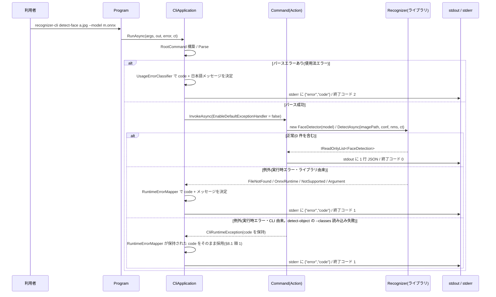

# cli — 設計

## 1. 概要

`src/Recognizer` の公開 API を端末から呼び出す CLI(`src/Recognizer.Cli`)を新規に追加する。CLI は推論ロジックを持たず、**引数解析 → ライブラリ呼び出し → JSON 整形 → 終了コード決定**の 4 責務に徹する薄い層とする。要件は `docs/specs/cli/requirements.md`(承認済み)を正とし、既存コードの調査・外部 API の実測は `docs/specs/cli/research.md` に記録した。

### ゴール

- 3 コマンド(`detect-face` / `detect-object` / `compare-face`)を提供し、結果を 1 行の JSON で stdout に出力する。
- エラーを「実行時エラー」「使用法エラー」に二分し、`{ "error", "code" }` の JSON を stderr に出して異なる終了コードで終わる。
- CLI の振る舞い(引数解析・JSON・終了コード・エラー)をインプロセスの自動テストで固定する。
- 3 RID の自己完結単一実行ファイルとして publish できる。

### 非ゴール

- 既存ライブラリ(`src/Recognizer`)のコード変更(公開 API・内部実装とも)。CLI は公開 API の利用者に徹する。
- CLI 独自の推論・後処理(閾値による同一人物判定、描画、順序の並べ替え)。ライブラリの返却値をそのまま反映する。
- 出力形式の切り替え・ロギング・進捗表示(要件のスコープ外)。

## 2. アーキテクチャ

### 既存システムの分析

`research.md` §1〜§6 に詳細。設計に効く事実は次の 4 点。

1. ライブラリは `string imagePath` オーバーロードを全コマンド分持つため、CLI は OpenCvSharp の `Mat` を直接扱わない(画像デコードはライブラリ内で完結する)。
2. ライブラリの `ArgumentException` は「画像のロード/デコード失敗」と「閾値の範囲外」の 2 系統があり、**送出箇所が分離**している(`Internal/ImageDecoder.cs` と各クラスの `EnsureThresholdInRange`)。CLI が閾値をパース時に検証すれば、ライブラリ実行中の `ArgumentException` は画像起因に限定できる(要件の前提 P1 が成立)。
3. `PublicApiTests` の 3 検査はすべて `src/Recognizer` 配下に閉じており、CLI の追加・stdout 出力・`System.CommandLine` 依存は抵触しない(前提 P5 が成立)。
4. CI の `dotnet test` はソリューション全体を対象とするが、`dotnet publish` は**ライブラリのパスがハードコード**されている(前提 P6 の論点)。

### Boundary Map(責務境界)

依存方向は上から下への単方向(`Program → Cli → Commands → {Output, Errors} → Recognizer`)。逆方向・循環はない。

| コンポーネント | 層 | 責務 | 所有するデータ/振る舞い |
| --- | --- | --- | --- |
| `Program` | エントリポイント | プロセス境界。`Main` から `CliApplication` を呼び、終了コードを返す | `Console.Out` / `Console.Error` / `Ctrl+C` の `CancellationToken` の供給のみ |
| `CliApplication` | アプリケーション | **CLI 全体の制御フロー**: RootCommand 構築 → Parse → 使用法エラー判定 → Invoke → 実行時エラー捕捉 → 終了コード決定 | 「エラーは JSON で stderr、非 0 終了」という CLI の中心ルール |
| `CommandFactory`(`Commands/*`) | アプリケーション | 各コマンドの引数・オプション定義と Action(ライブラリ呼び出し → DTO 変換 → JSON 出力) | コマンドごとの引数構成と既定値 |
| `ThresholdOption` | アプリケーション | 閾値オプションの生成。**数値変換と値域検証を一体で行う**(`CustomParser`) | 「閾値は 0.0〜1.0 の実数」という不変条件 |
| `ClassNamesFile` | アプリケーション | `--classes` ファイルの読み込み(1 行 1 クラス名) | 空行の除去・前後空白の除去 |
| `Output/*Dto` + `CliJson` | 出力 | ライブラリの結果型 → 出力 DTO への変換と、JSON シリアライズ(camelCase・1 行・invariant) | 出力 JSON の構造(要件 3・4・5・6 の契約) |
| `Errors/*` | エラー | 例外 → `code` のマッピング、パースエラー → `code` + 日本語メッセージの分類、エラー JSON の書き出し | 例外種別・使用法エラー種別と `code` の対応表 |
| `Recognizer`(既存) | ライブラリ | 推論・検出・類似度。CLI からは**公開 API のみ**利用 | 変更しない |

**ロジックの所在**: 「`code` の一覧」「例外 → `code` の対応」「終了コードの決定」は `Errors/` に集約する。例外は「例外型 → `code`」で機械的に決まるが、`--classes` の読み込み失敗だけは例外型がモデル不在と同じ(`FileNotFoundException`)で**発生箇所でしか判別できない**。この 1 点に限り `ClassNamesFile` が `Errors/ErrorCodes` の定数を使って `code` を付け(`CliRuntimeException` に包む)、`RuntimeErrorMapper` はそれをそのまま採用する(§8.1)。それ以外のコマンドは**ライブラリ呼び出しと DTO 組み立てのみ**を持つ。「JSON の形」は `Output/` に集約する(コマンド側は DTO を組み立てて渡すだけ)。

### 技術スタック

| 領域 | 採用技術 | 理由(出典) |
| --- | --- | --- |
| CLI フレームワーク | `System.CommandLine` **2.0.9**(安定版) | 要件 1.7 が指定。2.0 は GA 済みで beta 系と API が異なるため、devcontainer 上で実アセンブリをリフレクション検査・実行して API と挙動を実測した(`research.md` §7)。`Option.Required`、`SetAction(Func<ParseResult, CancellationToken, Task<int>>)`、`InvocationConfiguration.Output/Error`(TextWriter 差し替え可)、`ParseResult.Errors` を確認済み |
| JSON | `System.Text.Json`(BCL。追加依存なし) + **ソース生成**(`JsonSerializerContext`) | 単一ファイル publish でリフレクションに依存しない。camelCase は `JsonNamingPolicy.CamelCase`、`float` は既定で invariant なラウンドトリップ表記(要件 6.2・6.4) |
| テスト | xUnit 2.9.3(既存テストと同じ構成) | 既存 `Recognizer.Tests` の依存を踏襲(`research.md` §1) |
| 配布 | `dotnet publish -r <rid>`(`SelfContained` + `PublishSingleFile`) | 要件 9.1・9.2。トリミングは**しない**(OnnxRuntime / OpenCvSharp のネイティブ資産とリフレクションに対する安全側) |

## 3. File Structure Plan

| ファイルパス | 区分 | 責務 |
| --- | --- | --- |
| `src/Recognizer.Cli/Recognizer.Cli.csproj` | 新規 | net10.0 / Exe / nullable enable、`Recognizer` への ProjectReference、`System.CommandLine` 参照、`OpenCvSharp4` 参照(画像処理には使わない。ネイティブログ抑止のみ。§8.1)、3 RID の `RuntimeIdentifiers`、publish 設定、`InternalsVisibleTo(Recognizer.Cli.Tests)` |
| `src/Recognizer.Cli/Program.cs` | 新規 | エントリポイント。`Console.Out` / `Console.Error` / Ctrl+C の CancellationToken を `CliApplication.RunAsync` に渡し、終了コードを返すだけ。加えてプロセス起動時に UTF-8 出力と OpenCV ネイティブログの抑止を行う(下記) |
| `src/Recognizer.Cli/CliApplication.cs` | 新規 | 制御フロー: RootCommand 構築 → `Parse` → エラーがあれば使用法エラー JSON → なければ `InvokeAsync` → 実行時例外を捕捉して JSON → 終了コード |
| `src/Recognizer.Cli/ExitCodes.cs` | 新規 | 終了コード定数(`Success = 0` / `RuntimeError = 1` / `UsageError = 2`) |
| `src/Recognizer.Cli/Commands/DetectFaceCommand.cs` | 新規 | `detect-face` の定義と Action(`FaceDetector.DetectAsync` → `DetectFaceOutput`) |
| `src/Recognizer.Cli/Commands/DetectObjectCommand.cs` | 新規 | `detect-object` の定義と Action(`ClassNamesFile` → `ObjectDetector.DetectAsync` → `DetectObjectOutput`) |
| `src/Recognizer.Cli/Commands/CompareFaceCommand.cs` | 新規 | `compare-face` の定義と Action(`FaceRecognizer.CompareFacesAsync` → `CompareFaceOutput`) |
| `src/Recognizer.Cli/Commands/ThresholdOption.cs` | 新規 | 閾値 `Option<float>` の生成(`CustomParser` で数値変換 + 0.0〜1.0 の値域検証、失敗は `UsageErrorCollector` に記録) |
| `src/Recognizer.Cli/Commands/ClassNamesFile.cs` | 新規 | `--classes` の読み込み(空行除去・前後空白除去。IO 系例外は `code` 付きの `CliRuntimeException` に包んで送出。§8.1) |
| `src/Recognizer.Cli/Output/CliJson.cs` | 新規 | `JsonSerializerOptions`(camelCase・非整形)と 1 行書き出し |
| `src/Recognizer.Cli/Output/CliJsonContext.cs` | 新規 | `JsonSerializerContext`(ソース生成。出力 DTO 群を登録) |
| `src/Recognizer.Cli/Output/OutputDtos.cs` | 新規 | 出力 DTO 群(`BboxDto` / `PointDto` / `LandmarksDto` / `FaceDto` / `ObjectDto` / `ComparedFaceDto` / `DetectFaceOutput` / `DetectObjectOutput` / `CompareFaceOutput` / `ErrorOutput`)とライブラリ結果型からの変換。**プロパティ名は `Bbox`(`BBox` にしない。§7)** |
| `src/Recognizer.Cli/Errors/ErrorCodes.cs` | 新規 | `code` 文字列の定数(§8.1・§8.2 の対応表) |
| `src/Recognizer.Cli/Errors/CliRuntimeException.cs` | 新規 | `code` を保持する内部例外(`internal sealed class CliRuntimeException : Exception`)。発生箇所でしか判別できない実行時エラー(`--classes` の読み込み失敗)を `CliApplication` の catch へ搬送する(§8.1)。**`IOException` 系から派生させない**(§8.1 の型判定と絡むため) |
| `src/Recognizer.Cli/Errors/RuntimeErrorMapper.cs` | 新規 | 例外 → (`code`, 日本語メッセージ) のマッピング |
| `src/Recognizer.Cli/Errors/UsageErrorClassifier.cs` | 新規 | `ParseResult` → (`code`, 日本語メッセージ) の**構造的**分類(英語メッセージの文字列一致に依存しない) |
| `src/Recognizer.Cli/Errors/UsageErrorCollector.cs` | 新規 | `CustomParser` が検出した値エラー(解釈不能 / 値域外)を実行単位で収集する |
| `tests/Recognizer.Cli.Tests/Recognizer.Cli.Tests.csproj` | 新規 | xUnit。`Recognizer.Cli` への ProjectReference。**既存 Fixtures をリンク参照**(§9.2) |
| `tests/Recognizer.Cli.Tests/CliTestHost.cs` | 新規 | テスト用ヘルパー(`CliApplication.RunAsync` をインプロセス実行し stdout/stderr/終了コードを捕捉、Fixtures パス解決、一時画像の生成) |
| `tests/Recognizer.Cli.Tests/DetectFaceCommandTests.cs` | 新規 | 要件 3 の検証 |
| `tests/Recognizer.Cli.Tests/DetectObjectCommandTests.cs` | 新規 | 要件 4 の検証 |
| `tests/Recognizer.Cli.Tests/CompareFaceCommandTests.cs` | 新規 | 要件 5 の検証 |
| `tests/Recognizer.Cli.Tests/JsonOutputTests.cs` | 新規 | 要件 6 の検証(camelCase・1 行・invariant・stdout のみ) |
| `tests/Recognizer.Cli.Tests/ErrorHandlingTests.cs` | 新規 | 要件 2・7 の検証(使用法エラー・実行時エラー・終了コード) |
| `Recognizer.sln` | 変更 | `src` / `tests` の各ソリューションフォルダに CLI・CLI テストを追加 |
| `.github/workflows/ci.yml` | 変更 | CLI の publish ステップを 1 行追加(§10.2) |
| `README.md` | 変更 | CLI の使い方(コマンド・オプション・出力例・エラー・終了コード・publish 手順) |
| `docs/api-spec.md` | 変更 | §4 リポジトリ構成に CLI・CLI テストを追記。依存 5 件の制約が**ライブラリに掛かる**ことを明記(要件 10.4・10.5) |
| `CLAUDE.md` | 変更 | リポジトリ概要に CLI を追記(1 行) |

削除対象はない(新規追加のみ)。

## 4. システムフロー



## 5. Requirements Traceability(要件トレーサビリティ)

| 要件 ID | 要件内容(requirements.md より転記) | 設計要素 | 根拠・備考 |
| --- | --- | --- | --- |
| 1.1 | `src/Recognizer.Cli` を .NET 10 の実行可能プロジェクトとして持つ | `Recognizer.Cli.csproj`(`net10.0` / `OutputType=Exe`) | 既存 csproj の規約を踏襲(research §1) |
| 1.2 | `src/Recognizer.Cli` から `src/Recognizer` を ProjectReference で参照 | `Recognizer.Cli.csproj` | |
| 1.3 | `src/Recognizer` の公開 API のみ使用し、公開 API を変更しない | Boundary Map(§2)/ 非ゴール | CLI は `FaceDetector` / `ObjectDetector` / `FaceRecognizer` の `string` パス版のみ呼ぶ |
| 1.4 | `tests/Recognizer.Cli.Tests` を xUnit のテストプロジェクトとして持つ | `Recognizer.Cli.Tests.csproj` | |
| 1.5 | 両プロジェクトを `Recognizer.sln` に登録 | `Recognizer.sln`(変更) | `src` / `tests` フォルダ配下に追加 |
| 1.6 | `dotnet test` で既存 224 件が成功し、CLI テストも対象に含まれる | sln 登録 + §9 | 既存テストは変更しない。CLI 追加は `PublicApiTests` の 3 検査に抵触しない(research §6) |
| 1.7 | コマンドライン解析に `System.CommandLine` を使用 | 技術スタック(§2)/ `CliApplication` | 2.0.9 の API を実測(research §7) |
| 2.1 | 3 コマンドを提供 | `Commands/DetectFaceCommand` / `DetectObjectCommand` / `CompareFaceCommand` | |
| 2.2 | 画像を位置引数で受け取る(1 個 / 1 個 / 2 個) | 各 Command の `Argument<string>` | `Arity` は既定(必須 1 個) |
| 2.3 | 既定値: detect-face `--confidence` 0.7 / detect-object 0.5 / `--nms` 3 コマンド 0.5 / `--detection-threshold` 0.7 | `ThresholdOption`(`DefaultValueFactory`) | ライブラリの既定値と一致(api-spec 3.3・3.4・3.5) |
| 2.4 | 必須オプション欠落は使用法エラー | `Option.Required = true` + `UsageErrorClassifier` | code = `missingRequiredOption` |
| 2.5 | 位置引数の過不足・未知のコマンド/オプションは使用法エラー | `UsageErrorClassifier`(§8.2) | code = `missingArgument` / `unrecognizedArgument` / `missingCommand` |
| 2.6 | 閾値が数値として解釈できない / 0.0〜1.0 の範囲外は使用法エラー。**ライブラリを呼び出さない** | `ThresholdOption.CustomParser` + `UsageErrorCollector` | パース段階で弾くため Action に到達しない。`Validators` は使わない(変換不能値で `Parse` が例外を投げる。research §7.2) |
| 2.7 | `--help` はコマンド・オプション一覧を出力し終了コード 0 | `System.CommandLine` の `HelpAction` | 実測で `Errors` 0 件 / exit 0 を確認(research §7.2) |
| 3.1 | `detect-face` は `FaceDetector` で検出し JSON を stdout、終了コード 0 | `DetectFaceCommand` | |
| 3.2 | トップレベルに `image` と `faces` | `DetectFaceOutput(string Image, IReadOnlyList<FaceDto> Faces)` | |
| 3.3 | `faces` の各要素に `bbox` / `confidence` / `landmarks` | `FaceDto(BboxDto Bbox, float Confidence, LandmarksDto? Landmarks)` | プロパティ名は `Bbox`。`BBox` だと camelCase 変換で `"bBox"` になり要件違反(§7 の実測) |
| 3.4 | ランドマークを出力するモデルでは 5 点(`x`/`y`)を出力 | `LandmarksDto` ← `FaceLandmarks` | |
| 3.5 | ランドマークを出力しないモデルでは `landmarks` は `null` | `FaceDto.Landmarks` は null 許容。**null も出力する**(`DefaultIgnoreCondition` を設定しない) | |
| 3.6 | 顔 0 件は空配列 + 終了コード 0 | `DetectFaceCommand`(空リストをそのまま DTO 化) | 例外にしない(要件 7.9) |
| 3.7 | `faces` はライブラリの返却順(信頼度降順)のまま | `DetectFaceCommand`(並べ替えをしない) | |
| 4.1 | `detect-object` は `ObjectDetector` で検出し JSON を stdout、終了コード 0 | `DetectObjectCommand` | |
| 4.2 | トップレベルに `image` と `objects` | `DetectObjectOutput(string Image, IReadOnlyList<ObjectDto> Objects)` | |
| 4.3 | `objects` の各要素に `classId` / `className` / `confidence` / `bbox` | `ObjectDto(int ClassId, string ClassName, float Confidence, BboxDto Bbox)` | 同上(§7 の実測) |
| 4.4 | `--classes` 指定時はファイルを 1 行 1 クラス名で読み `classNames` に渡す | `ClassNamesFile.Read` → `ObjectDetector(modelPath, classNames)` | |
| 4.5 | `--classes` 省略時はライブラリ既定のクラス名解決に委ねる | `ObjectDetector(modelPath, null)` | `ObjectDetector.cs:260`(範囲内は参照 / 80 クラスなら COCO / それ以外 `class_{id}`) |
| 4.6 | 行数がクラス数と不一致でもエラーにしない | `ClassNamesFile`(件数検証をしない) | ライブラリが範囲外 ID を `class_{id}` にフォールバック(`ObjectDetector.cs:260`) |
| 4.7 | 物体 0 件は空配列 + 終了コード 0 | `DetectObjectCommand` | |
| 4.8 | `objects` はライブラリの返却順(信頼度降順)のまま | `DetectObjectCommand`(並べ替えをしない) | |
| 5.1 | `compare-face` は `CompareFacesAsync` を呼び JSON を stdout、終了コード 0 | `CompareFaceCommand` | |
| 5.2 | `image1` / `image2` / `status` / `similarity` / `face1` / `face2` を含む | `CompareFaceOutput` | |
| 5.3 | `status` は `Success` / `NoFaceInImage1` / `NoFaceInImage2` の文字列 | `JsonStringEnumConverter`(**命名ポリシーを適用しない** = 列挙子名そのまま) | 要件 6.2 の但し書きに対応 |
| 5.4 | 同一人物判定をせず類似度のみ出力 | `CompareFaceCommand`(閾値比較をしない) | 非ゴール(§1) |
| 5.5 | `Success` の間、`face1` / `face2` に使用した顔の `bbox` と `confidence` | `CompareFaceOutput.Face1/Face2`(`ComparedFaceDto`) | ランドマークは含めない(要件が `bbox` と `confidence` のみを規定) |
| 5.6 | `NoFaceInImage1` の間、`similarity` 0・`face1` / `face2` とも `null`・終了コード 0 | `CompareFaceOutput`(ライブラリ返却値をそのまま反映) | `FaceRecognizer.cs:252` が `(NoFaceInImage1, 0f, null, null)` を返す |
| 5.7 | `NoFaceInImage2` の間、`similarity` 0・`face1` は出力・`face2` は `null`・終了コード 0 | 同上 | `FaceRecognizer.cs:262` が `(NoFaceInImage2, 0f, first.Face, null)` を返す |
| 5.8 | ライブラリの `FaceComparisonResult` の値をそのまま反映(補正しない) | `CompareFaceCommand` / `CompareFaceOutput.From(result)` | |
| 6.1 | 成功時の結果はすべて stdout。stderr に出さない | `CliApplication`(成功時は `Output` にのみ書く) | テストで stderr が空であることを検証(§9) |
| 6.2 | プロパティ名は camelCase(`status` の値は列挙子名のまま) | `CliJson`(`PropertyNamingPolicy = CamelCase`)+ `JsonStringEnumConverter()` | 列挙子名には命名ポリシーを適用しない |
| 6.3 | 整形せず 1 行(末尾の改行 1 個は許容) | `CliJson`(`WriteIndented = false`)+ `WriteLine` 1 回 | |
| 6.4 | 浮動小数点数は invariant 形式 | `System.Text.Json` の既定(カルチャ非依存のラウンドトリップ表記) | ロケール依存の `,` 小数点にならない |
| 6.5 | `image` / `image1` / `image2` は位置引数の文字列をそのまま(正規化しない) | 各 Command(`Path.GetFullPath` を呼ばない) | |
| 7.1 | 実行時/使用法エラーは `error` と `code` を持つ JSON を stderr に出力 | `ErrorOutput`(`Output/OutputDtos.cs`。他の出力 DTO と同居)+ `CliApplication` | 生成は `Errors/`(`RuntimeErrorMapper` / `UsageErrorClassifier`)、シリアライズは `Output/` |
| 7.2 | エラー時は stdout に何も出力しない | `CliApplication`(JSON は結果確定後に 1 回だけ書く。例外時は書かない) | 各 Action は「ライブラリ呼び出し → DTO 生成 → 書き出し」の順で、例外は書き出し前に飛ぶ |
| 7.3 | 終了コードは 成功 0 / 実行時エラー / 使用法エラー の 3 種で、後 2 者は互いに異なる非 0 | `ExitCodes`(`Success = 0` / `RuntimeError = 1` / `UsageError = 2`) | §8.3 |
| 7.4 | 画像不在・デコード不可は実行時エラー | `RuntimeErrorMapper`(`ArgumentException` → `imageLoadFailed`) | ライブラリは画像失敗に `ArgumentException`(`ImageDecoder.cs:45`)。閾値は事前検証済みのため到達しない(前提 P1) |
| 7.5 | モデル不在・ロード失敗・非対応形式は実行時エラー | `RuntimeErrorMapper`(`FileNotFoundException` → `modelNotFound` / `OnnxRuntimeException` → `modelLoadFailed` / `NotSupportedException` → `unsupportedModelFormat`) | 送出箇所は research §3 |
| 7.6 | `--classes` のファイル不在は実行時エラー | `ClassNamesFile` が `CliRuntimeException(classesFileNotFound)` を送出 | モデル不在(`modelNotFound`)と区別する(§8.1) |
| 7.7 | 実行時エラーの `code` は例外種別と発生箇所から一意に決定 | §8.1 の対応表 / `RuntimeErrorMapper` | 例外型だけでは区別できない `--classes` 由来の `FileNotFoundException` は、発生箇所で `code` を付けた `CliRuntimeException` に包んで搬送する(§8.1 の順 1) |
| 7.8 | 使用法エラーの `code` は CLI が定義する種別から一意に決定 | §8.2 の対応表 / `UsageErrorClassifier` + `UsageErrorCollector` | 英語のフレームワークメッセージに依存せず `SymbolResult` の構造で分類 |
| 7.9 | 検出 0 件・顔未検出は失敗として扱わない(終了コード 0・stderr なし) | 各 Command(結果型をそのまま JSON 化) | |
| 8.1 | 3 コマンドの正常系 JSON と終了コード 0 を検証するテスト | `DetectFaceCommandTests` / `DetectObjectCommandTests` / `CompareFaceCommandTests` | §9.1 |
| 8.2 | 使用法エラー・実行時エラーの stderr JSON と終了コードを検証するテスト | `ErrorHandlingTests` | §9.1 |
| 8.3 | 検出 0 件・顔未検出で終了コード 0 と空配列 / status を検証するテスト | `DetectFaceCommandTests` / `CompareFaceCommandTests` | `face_inputconf_f5.onnx` + 黒画像で未検出を作る(§9.3) |
| 8.4 | テスト用 ONNX は既存 Fixtures を再利用(供給方法は設計で確定) | `Recognizer.Cli.Tests.csproj` の**リンク参照**(§9.2) | ファイルを複製せず、`..\Recognizer.Tests\Fixtures\*.onnx` を出力ディレクトリへコピー |
| 8.5 | CLI テストは 3 プラットフォームのいずれでも成功 | インプロセス実行 + パス操作は `Path.Combine` / 一時ディレクトリ | プロセス起動・シェル依存を避ける(§9.1) |
| 9.1 | `dotnet publish -r <rid>` で自己完結の単一実行ファイルを生成 | `Recognizer.Cli.csproj`(`SelfContained` / `PublishSingleFile`) | §10.1 |
| 9.2 | 3 RID を publish の対象として設定(検証手段は設計で確定) | `RuntimeIdentifiers` + **CI に CLI publish ステップを追加**(§10.2) | 3 RID すべてを CI マトリクスの実機で検証する(前提 P6 の決着) |
| 9.3 | linux-x64 の publish 成果物が devcontainer 上で 3 コマンドを実行でき、要件 3〜7 を満たす | 実装フェーズのスモーク検証(§9.4) | publish → 実バイナリで 3 コマンド + エラー 2 系統を実行し、JSON と終了コードを確認する |
| 10.1 | README に 3 コマンドの構文・オプション・既定値 | `README.md`(変更) | |
| 10.2 | README に JSON 出力例・エラー JSON 例・終了コード一覧 | `README.md`(変更) | §8 の対応表を転記 |
| 10.3 | README に RID 別の publish 手順 | `README.md`(変更) | |
| 10.4 | `docs/api-spec.md` §4 に CLI・CLI テストを追記 | `docs/api-spec.md`(変更) | |
| 10.5 | 依存 5 件の制約がライブラリに掛かる制約であることを明記 | `docs/api-spec.md` §2/§5(変更) | `System.CommandLine` は CLI 固有依存で対象外 |

過剰設計の確認: 上表に現れない設計要素はない(すべての新規ファイルが 1 つ以上の要件に対応する)。

## 6. コンポーネントとインターフェース

### CliApplication

- **依存(inbound)**: `Program`(本番)、`CliTestHost`(テスト)
- **依存(outbound)**: `Commands/*`、`Errors/*`
- **外部依存(external)**: `System.CommandLine`
- **インターフェース/契約**:

```csharp
public static Task<int> RunAsync(string[] args, TextWriter output, TextWriter error, CancellationToken cancellationToken);
```

- 事前条件: `args` / `output` / `error` は非 null。
- 事後条件: 戻り値は `ExitCodes` のいずれか。**成功時のみ `output` に 1 行の JSON を書く**。エラー時は `error` にのみ 1 行の JSON を書き、`output` には何も書かない。例外は外へ漏らさない(未知の例外も `unexpectedError` として JSON 化する)。
- 実行単位ごとに RootCommand と `UsageErrorCollector` を**新規生成**する(可変状態を実行間で共有しない = テストの並行実行で安全)。

### ThresholdOption

```csharp
internal static Option<float> Create(string name, float defaultValue, UsageErrorCollector collector);
```

- 事前条件: `0.0f <= defaultValue <= 1.0f`。
- 事後条件: 返る `Option<float>` は、値が省略されれば `defaultValue`、数値変換に失敗すれば `collector` に `invalidOptionValue` を記録して `ParseError` を追加、0.0〜1.0 の範囲外なら `optionValueOutOfRange` を記録して `ParseError` を追加する。**例外を投げない**。
- **値域判定は `!(v >= 0f && v <= 1f)` と書く**(`v < 0f || v > 1f` と書かない)。`float.TryParse` は `NaN` の解析に成功し、`NaN` はあらゆる比較が false になるため、素朴な判定では `--confidence NaN` が値域検証を素通りしてライブラリに渡ってしまう(実測。ライブラリ側の `EnsureThresholdInRange` も同じ穴を持つため、CLI で止めないと検出処理まで到達する)。要件 2.6 は「0.0 以上 1.0 以下の範囲外」を使用法エラーとするため、`NaN` は `optionValueOutOfRange` として弾く。
- 数値変換は `float.TryParse(raw, NumberStyles.Float, CultureInfo.InvariantCulture, out var v)` を使う(ロケール依存で `0.7` の解釈が変わらないようにする)。
- Why not `Option.Validators`: バリデータ内で値を取得すると、変換不能な値(`--confidence abc`)に対して `Parse()` 自体が `InvalidOperationException` を投げ、CLI が JSON を出す前にクラッシュする(実測。`research.md` §7.2)。`CustomParser` なら変換失敗も値域違反も `ParseError` として表現できる。

### ClassNamesFile

```csharp
internal static IReadOnlyList<string> Read(string path);
```

- 事前条件: `path` は非 null。
- 事後条件: ファイルの各行を前後空白除去した文字列のリストを、**空行を除いて**行順に返す。**行数の検証はしない**(要件 4.6)。
- 事後条件(異常系): IO 系の例外を捕捉し、`code` を付けた `CliRuntimeException` に包んで送出する。素の `FileNotFoundException` を外へ漏らさない(漏らすと §8.1 の順 2 に一致して `modelNotFound` と誤判定される)。
  - `FileNotFoundException` / `DirectoryNotFoundException` → `classesFileNotFound`
  - `IOException` / `UnauthorizedAccessException` → `classesFileReadFailed`
  - **catch の順序は派生 → 基底**(`FileNotFoundException` と `DirectoryNotFoundException` は `IOException` の派生。先に `IOException` を捕捉すると両者が吸われる)。

### RuntimeErrorMapper / UsageErrorClassifier

```csharp
internal static ErrorOutput Map(Exception exception);                 // 例外 → {error, code}
internal static ErrorOutput Classify(ParseResult parseResult, UsageErrorCollector collector);  // パース失敗 → {error, code}
```

- 事後条件: いずれも §8 の対応表に定める `code` のいずれかを返し、`error` は日本語のメッセージとする。

## 7. データモデル

出力 DTO は CLI が所有する(ライブラリの結果型を直接シリアライズしない)。理由は、JSON の形(camelCase、`bbox` への平坦化、`landmarks` の null 表現)を CLI 側の契約として固定し、ライブラリの `RectangleF` / `PointF` の内部表現に引きずられないため。

```csharp
internal sealed record BboxDto(float X, float Y, float Width, float Height);
internal sealed record PointDto(float X, float Y);
internal sealed record LandmarksDto(PointDto LeftEye, PointDto RightEye, PointDto Nose, PointDto LeftMouth, PointDto RightMouth);

internal sealed record FaceDto(BboxDto Bbox, float Confidence, LandmarksDto? Landmarks);
internal sealed record ObjectDto(int ClassId, string ClassName, float Confidence, BboxDto Bbox);
internal sealed record ComparedFaceDto(BboxDto Bbox, float Confidence);   // 要件 5.5: bbox と confidence のみ

internal sealed record DetectFaceOutput(string Image, IReadOnlyList<FaceDto> Faces);
internal sealed record DetectObjectOutput(string Image, IReadOnlyList<ObjectDto> Objects);
internal sealed record CompareFaceOutput(string Image1, string Image2, FaceComparisonStatus Status, float Similarity, ComparedFaceDto? Face1, ComparedFaceDto? Face2);
internal sealed record ErrorOutput(string Error, string Code);
```

- **不変条件**: すべて `record` + 完全コンストラクタで生成時に値が揃う(部分的に構築された DTO が存在しない)。`Faces` / `Objects` は null にならない(0 件は空リスト)。
- **プロパティ名は `Bbox` であって `BBox` ではない(重要)**: `JsonNamingPolicy.CamelCase` は先頭の連続する大文字列をまとめて小文字化するため、`BBox` は `"bbox"` ではなく **`"bBox"`** になる(実測で確認)。要件 3.3 / 4.3 / 5.5 が求めるのは `bbox` なので、DTO のプロパティ名を `Bbox` とする。実測値:

  ```text
  record FaceDto(BboxDto BBox, ...) → {"bBox":{...},"confidence":0.95}   ← 要件違反
  record FaceDto(BboxDto Bbox, ...) → {"bbox":{...},"confidence":0.95}   ← 正しい
  ```

  この 1 点はテストで固定する(要件 6.2)。`ClassId` → `classId`、`Image1` → `image1` は素直に変換される。
- **シリアライズの結線**: ソース生成の型情報を `JsonSerializerOptions` 経由で使う。`JsonSerializer.Serialize(value, CliJsonContext.Default.DetectFaceOutput)` と**直接呼ぶと命名ポリシーと列挙子変換が効かず**、`{"Image":...,"Faces":[{"BBox":...}]}`(PascalCase・enum が数値)になる(実測)。必ず次の options を通す。

  ```csharp
  new JsonSerializerOptions
  {
      TypeInfoResolver = CliJsonContext.Default,
      PropertyNamingPolicy = JsonNamingPolicy.CamelCase,
      Converters = { new JsonStringEnumConverter() },   // 命名ポリシーを渡さない = 列挙子名そのまま(要件 5.3・6.2)
      WriteIndented = false,                            // 要件 6.3
      Encoder = JavaScriptEncoder.Create(UnicodeRanges.All),  // 実装フェーズで追加(下記)
  }
  ```

  `Encoder` は実装フェーズで追加した。既定のエンコーダは非 ASCII をすべて `\uXXXX` にエスケープするため、日本語のエラーメッセージ(`error`。要件 7.1 は「人間可読なメッセージ」を求める)が端末で読めなくなる。`UnsafeRelaxedJsonEscaping` は `<script>` を素通しするため採らない。`UnicodeRanges.All` でも `<` `>` `&` `'` と U+2028 / U+2029 はエスケープされ続けることを実測で確認しており(1 行出力の要件 6.3 も守られる)、既定比で安全性は後退しない。

  実測: `{"image1":"a.jpg","status":"NoFaceInImage1","similarity":0,"face1":null}`。`CurrentCulture = de-DE` でも `0.7` は `0.7` のまま(要件 6.4)。
- **ロジックの所在**: ライブラリ結果型 → DTO の変換は `OutputDtos.cs` の静的 `From(...)` に集約する(コマンド側に変換ロジックを散らさない)。

## 8. エラーハンドリング

### 8.1 実行時エラー(終了コード 1)

`CliApplication` が `InvokeAsync` を `try/catch` で囲み、`RuntimeErrorMapper` で分類する。`System.CommandLine` の既定例外ハンドラは**無効化**する(`EnableDefaultExceptionHandler = false`)。既定のままだと英語のスタックトレースが stderr に出て、JSON 契約(要件 7.1)を破るため。

`RuntimeErrorMapper.Map(Exception)` は、次の表を**上から順に**評価して最初に一致した行の `code` を返す。

| 順 | 例外型 | 発生元(実コード) | `code` | 日本語メッセージ(例) |
| --- | --- | --- | --- | --- |
| 1 | `CliRuntimeException`(CLI 自身が投げる。`Code` を保持) | `ClassNamesFile.Read` | 例外が保持する `Code` をそのまま使う(`classesFileNotFound` / `classesFileReadFailed`) | クラス名ファイルが見つかりません: `<path>` |
| 2 | `FileNotFoundException` | `FaceDetector.cs:33` / `ObjectDetector.cs:42` / `FaceRecognizer.cs:46` | `modelNotFound` | モデルファイルが見つかりません: `<path>` |
| 3 | `OnnxRuntimeException` | ONNX Runtime(ライブラリは包まず透過。`FaceDetector.cs:36`) | `modelLoadFailed` | モデルを読み込めませんでした: `<原因>` |
| 4 | `NotSupportedException` | `Internal/ModelIntrospector.cs`(27 箇所) | `unsupportedModelFormat` | 非対応のモデル形式です: `<原因>` |
| 5 | `ArgumentException` | `Internal/ImageDecoder.cs:23,45,63,74` | `imageLoadFailed` | 画像を読み込めませんでした: `<原因>` |
| 6 | 上記以外 | — | `unexpectedError` | 予期しないエラーが発生しました: `<原因>` |

- **`FileNotFoundException` の 2 分岐をどう一意にするか(要件 7.6・7.7)**: `--classes` のファイル不在も `FileNotFoundException` であり、例外**型**だけではモデル不在(順 2)と区別できない。そこで `ClassNamesFile.Read` は、捕捉した IO 系例外を **`code` を保持する内部例外 `CliRuntimeException` に包んで**送出する(捕捉する型と `code` の対応は §6 の `ClassNamesFile` の契約が正本。`FileNotFoundException` / `DirectoryNotFoundException` → `classesFileNotFound`、`IOException` / `UnauthorizedAccessException` → `classesFileReadFailed`)。`RuntimeErrorMapper` は順 1 でこれを最優先に扱うため、発生箇所が `code` に一意に反映される。
  - Why: Action の戻り値は `int`(`SetAction(Func<ParseResult, CancellationToken, Task<int>>)`)であり、Action から `ErrorOutput` を返す経路は存在しない。エラーの搬送手段は例外に限られる。`code` を例外に載せることで、分類の知識を `Errors/` に集約したまま(Boundary Map §2)、発生箇所の情報を失わずに `CliApplication` の単一の `catch` へ届けられる。
  - Why not `FileNotFoundException.FileName` と `--classes` のパスを突き合わせる: 同じパスをモデルにも指定できてしまい(`--model a.txt --classes a.txt`)、判別が壊れる。
  - `CliRuntimeException` は CLI 内部の搬送専用(`internal`)で、公開 API には現れない。予期されるエラーを結果型で表すという規約(CLAUDE.md)との関係は、**プロセスをそのまま非 0 終了させる終端エラー**であり、ライブラリが同種の失敗に例外を使っている(モデル不在 → `FileNotFoundException`)ことと整合するため、例外での搬送を採る。
- `ArgumentException` は閾値検証を CLI が事前に済ませているため、ここに到達するものは画像起因に限定される(前提 P1、research §3)。
- `OperationCanceledException`(Ctrl+C)は `unexpectedError` に落ちる。要件に無いため専用の code は設けない(YAGNI)。

**実装フェーズで追加: OpenCV ネイティブログの抑止(要件 7.1)**

OpenCV のネイティブ層は画像の読み込みに失敗すると、.NET の `TextWriter` を経由せず **fd 2 へ直接**警告行を書く(実測: `[ WARN:0@0.028] global loadsave.cpp:278 findDecoder imread_('...'): can't open/read file`)。放置すると、最も頻度の高い実行時エラー(画像不在)で **stderr が「警告行 + エラー JSON」の 2 行**になり、stderr を JSON としてパースする利用者が壊れる(要件 7.1 の機械可読なエラー出力が成立しない)。

そこで `Program` の起動時に `Cv2.SetLogLevel(LogLevel.SILENT)` を呼び、CLI の stderr を JSON だけに保つ。これに伴い `Recognizer.Cli` は `OpenCvSharp4` を**直接参照**する(画像処理には使わない。ログ抑止のみ)。

- Why not 環境変数 `OPENCV_LOG_LEVEL=SILENT`: .NET の `Environment.SetEnvironmentVariable` は Unix のネイティブ `getenv` に伝播せず、プロセス内から設定しても効かない(実測)。
- Why not 放置して「stderr の最終行を読め」と文書化する: 要件 7.1 の目的(スクリプトからのエラー種別分岐)を利用者側の回避策に転嫁することになる。
- この警告は .NET の `TextWriter` を経由しないため、**インプロセスのテストでは観測できない**(要件 8.x の自動テストで捕捉不能)。回帰の検出は publish 成果物のスモーク検証(§9.4)で行う。

### 8.2 使用法エラー(終了コード 2)

`rootCommand.Parse(args)` の結果 `Errors.Count > 0` のとき、`InvokeAsync` を呼ばずに `UsageErrorClassifier` が分類する。**フレームワークの英語メッセージを文字列一致で判定しない**(将来のバージョンで文言が変わると壊れるため)。`SymbolResult` の型と `UnmatchedTokens` の構造で判定する(実測に基づく。research §7.2)。

判定順序(先に一致したものを採用):

| 順 | 判定条件(構造的。`e` は `ParseError`) | `code` | 日本語メッセージ(例) |
| --- | --- | --- | --- |
| 1 | `UsageErrorCollector` に「解釈不能」の記録がある | `invalidOptionValue` | `--confidence` は数値で指定してください(指定値: abc)。 |
| 2 | `UsageErrorCollector` に「値域外」の記録がある | `optionValueOutOfRange` | `--confidence` は 0.0 以上 1.0 以下で指定してください(指定値: 1.5)。 |
| 3 | `ParseResult.UnmatchedTokens` が空でない | `unrecognizedArgument` | 認識できない引数です: `b.jpg` |
| 4 | `e.SymbolResult is OptionResult or && or.Option.Required && or.Tokens.Count == 0` | `missingRequiredOption` | 必須オプション `--model` の値が指定されていません。(オプション自体の欠落と、`--model` を値なしで書いた場合の両方がこの条件に一致するため、どちらでも成り立つ文言にする) |
| 5 | `e.SymbolResult is OptionResult or && or.Tokens.Count == 0`(必須でないオプションに値が無い) | `invalidOptionValue` | `--confidence` には値が必要です。 |
| 6 | `e.SymbolResult is ArgumentResult` | `missingArgument` | 位置引数 `image` が指定されていません。 |
| 7 | `CommandResult.Command` が RootCommand(サブコマンド未指定) | `missingCommand` | コマンドを指定してください(detect-face / detect-object / compare-face)。 |
| 8 | 上記以外 | `invalidUsage` | 引数が不正です。 |

- 順序 3 の根拠(実測): 未知のコマンド(`nosuch`)は `UnmatchedTokens` に載りつつ `CommandResult.Command` が RootCommand にもなる。3 を 7 より先に評価することで「未知のコマンド」を `unrecognizedArgument`、「コマンド未指定(引数なし)」を `missingCommand` に振り分けられる。
- 順序 4・5 の根拠(実測): `--confidence` を**値なしで**指定すると(`detect-face a.jpg --model m.onnx --confidence`)、`CustomParser` は呼ばれず(`UsageErrorCollector` は空)、`SymbolResult` が `OptionResult(--confidence)` の `ParseError` が 1 件立つ。順序 4 の述語に `Option.Required` を含めないと、必須でない `--confidence` を「必須オプション欠落」と**誤分類する**。したがって 4 は `Required` かつトークン 0 に限定し、必須でないオプションの値欠落は 5 で `invalidOptionValue`(= 値を解釈できない。要件 7.8 の「値の解釈不能」に含める)として扱う。
- `--help` は `Errors` が 0 件で `HelpAction` が動くため、この経路に入らない(終了コード 0。要件 2.7)。実測で、必須オプションを欠いた `detect-face --help` でも `Errors` は 0 件になることを確認済み。
- 複数種別が同時に起きた場合は、上の順序で最初に一致した 1 件を採用する(`code` は常に一意。要件 7.8)。

### 8.3 終了コード

| 値 | 意味 |
| --- | --- |
| 0 | 成功(検出 0 件・顔未検出を含む。要件 7.9)、`--help` |
| 1 | 実行時エラー(§8.1) |
| 2 | 使用法エラー(§8.2) |

## 9. テスト戦略

### 9.1 テストの実行形態: インプロセス

CLI をプロセス起動せず、`CliApplication.RunAsync(args, StringWriter, StringWriter, ct)` をインプロセスで呼んで stdout / stderr / 終了コードを検証する。

- Why: プロセス起動はシェル・実行ファイル名・パス区切り・publish 状態への依存を持ち込み、3 プラットフォームでの安定性(要件 8.5)を損なう。`InvocationConfiguration.Output` / `Error` が `TextWriter` で差し替え可能なことは実測済み(research §7.1)。
- モックは使わない。ライブラリ(ONNX 推論)は決定論的なダミー ONNX で実物を動かす(モックはシステム境界のみという原則に照らし、ここに境界はない)。
- テストは `Recognizer.Cli` の internal に触れるため、`InternalsVisibleTo("Recognizer.Cli.Tests")` を CLI 側に設定する。ただし**検証は原則 `RunAsync` の外形(JSON 文字列・終了コード)**で行い、内部実装への結合を避ける。

### 9.2 テスト用 ONNX の供給(前提 P4 の決着)

`tests/Recognizer.Cli.Tests/Recognizer.Cli.Tests.csproj` に**リンク参照**を置き、既存 Fixtures を出力ディレクトリへコピーする(ファイルをリポジトリに複製しない)。

```xml
<ItemGroup>
  <None Include="..\Recognizer.Tests\Fixtures\*.onnx" LinkBase="Fixtures" CopyToOutputDirectory="PreserveNewest" />
</ItemGroup>
```

パス解決は既存テストと同じ `Path.Combine(AppContext.BaseDirectory, "Fixtures", fileName)`(`FaceDetectorTests.cs:13-14` と同形)。テスト用画像は既存テストと同様に `Cv2.ImWrite` で一時 PNG を生成する(`FaceDetectorTests.cs:274-275` と同形)。

### 9.3 使用する Fixture と期待値(決定論)

| テスト | Fixture / 入力 | 期待 |
| --- | --- | --- |
| detect-face 正常系 | `face_nchw_transposed_f5.onnx` + 任意の PNG | 定数出力で 3 件。`landmarks` は `null`(要件 3.5) |
| detect-face ランドマーク | `face_nchw_transposed_f20.onnx` | `landmarks` に 5 点(要件 3.4) |
| detect-face 0 件 | `face_inputconf_f5.onnx` + **黒画像** | `faces: []`、終了コード 0(要件 3.6) |
| detect-object 正常系 | `object_nchw_transposed_4c3.onnx` | 3 件、信頼度降順(要件 4.3・4.8) |
| detect-object COCO 既定 | `object_transposed_coco80.onnx`(`--classes` 省略) | `className` が COCO 名(要件 4.5) |
| detect-object `--classes` | `object_nchw_transposed_4c3.onnx` + 3 行のクラス名ファイル | 指定名で解決(要件 4.4)。1 行のファイルでもエラーにならない(要件 4.6) |
| compare-face Success | `face_inputconf_f5.onnx` + `embed_nchw_meanrgb_d4.onnx` + 白画像 2 枚 | `status: "Success"`、`face1` / `face2` あり(要件 5.5) |
| compare-face NoFaceInImage1 | 黒画像 + 白画像 | `similarity: 0`、`face1` / `face2` とも `null`(要件 5.6) |
| compare-face NoFaceInImage2 | 白画像 + 黒画像 | `face1` あり、`face2` は `null`(要件 5.7) |
| 実行時エラー | 存在しないモデル / 壊れた ONNX / `face_unsupported_f7.onnx` / 存在しない画像 / 存在しない `--classes` | 各 `code` と終了コード 1(要件 7.4〜7.7) |
| 使用法エラー | `--model` 欠落 / `--confidence abc` / `--confidence 1.5` / `--confidence NaN` / `--confidence`(値なし)/ 位置引数過剰 / 位置引数不足 / 未知オプション / 未知コマンド / コマンド未指定 | 各 `code` と終了コード 2(要件 2.4〜2.6・7.8)。§8.2 の 8 行すべてを 1 ケース以上で覆う |
| 閾値がライブラリに渡らないこと | `--confidence 1.5`(存在しないモデルパスと併用) | 使用法エラー(終了コード 2)になり、モデル不在の実行時エラーにならない = ライブラリを呼んでいない(要件 2.6) |
| `--help` | `detect-face --help`(必須オプションなし) | 終了コード 0、stderr が空(要件 2.7) |
| JSON 契約 | detect-face の出力 | 1 行(改行は末尾のみ)・キーが `bbox`(`bBox` でない)・`status` は列挙子名・stderr が空(要件 6.1〜6.5) |

### 9.4 publish のスモーク検証(要件 9.3)

実装フェーズの最後に devcontainer 上で 1 回実施し、結果を Implementation Notes に記録する(自動テストにはしない。publish は数十秒かかり、単体テストの実行時間を大きく損なうため)。

```bash
dotnet publish src/Recognizer.Cli/Recognizer.Cli.csproj -c Release -r linux-x64 -o /tmp/cli-publish
/tmp/cli-publish/recognizer <3 コマンド + エラー 2 系統>  # JSON と終了コードを確認
```

**stderr が 1 行の JSON であることを必ず検査する**(§8.1 の「OpenCV ネイティブログの抑止」の回帰は、ネイティブが fd 2 に直接書くためインプロセスのテストでは捕捉できない。ここが唯一の検出点):

```bash
/tmp/cli-publish/recognizer detect-face /tmp/no-such.png --model <model> 2>/tmp/err.txt
test "$(wc -l < /tmp/err.txt)" -eq 1                      # 警告行が混ざっていないこと
python3 -c "import json; json.load(open('/tmp/err.txt'))"  # そのまま JSON としてパースできること
```

## 10. その他

### 10.1 publish 設定(要件 9.1・9.2)

`Recognizer.Cli.csproj` に置く。

| プロパティ | 値 | 理由 |
| --- | --- | --- |
| `OutputType` | `Exe` | 実行可能 |
| `AssemblyName` | `recognizer` | 実行ファイル名(`recognizer` / `recognizer.exe`) |
| `RuntimeIdentifiers` | `linux-x64;win-x64;osx-arm64` | 要件 9.2。ライブラリと同じ 3 RID |
| `SelfContained` | `true` | .NET ランタイム同梱(要件 9.1) |
| `PublishSingleFile` | `true` | 単一実行ファイル(要件 9.1) |
| `IncludeNativeLibrariesForSelfExtract` | `true` | OnnxRuntime / OpenCvSharp のネイティブ資産を単一ファイルに含める |
| `PublishTrimmed` | 設定しない(既定 false) | Why not: OnnxRuntime / OpenCvSharp はリフレクションとネイティブ相互運用を含み、トリミングは実行時破損のリスクがある。単一ファイルのサイズより確実性を優先する |
| `InvariantGlobalization` | `true` | 出力の invariant 性(要件 6.4)を環境非依存にし、ICU 依存を落とす |

### 10.2 CI への反映(前提 P6 の決着)

**CLI の publish ステップを追加する**(`.github/workflows/ci.yml`)。理由: 要件 9.2 は 3 RID を publish 対象とすることを求めるが、`win-x64` / `osx-arm64` は devcontainer で検証できない。CI マトリクスは既に 3 プラットフォームの実機を回しており、1 行の追加で「3 RID すべてで単一ファイル publish が成功する」ことを実機検証できる。追加しない場合、要件 9.2 は csproj の静的確認どまりになる。

```yaml
- run: dotnet publish src/Recognizer.Cli/Recognizer.Cli.csproj -c Release -r ${{ matrix.rid }} -o publish-cli-${{ matrix.rid }}
```

`dotnet test` はソリューション全体を対象とするため、CLI テストは sln 登録だけで CI に乗る(変更不要)。

### 10.3 セキュリティ

CLI はローカルのファイルパスを受け取ってローカルで推論するのみで、ネットワーク・認証・機微データの永続化を伴わない。信頼境界はプロセス境界(利用者が渡す引数とファイル)のみで、外部入力は「パス」と「閾値」に限られる。パスは OS のファイル権限に委ね、閾値は値域検証する。エラーメッセージには例外の原因(パス・形状)を含めるが、CLI 実行者自身が与えた情報の範囲であり、権限昇格・情報漏洩の経路にならない。STRIDE 上、追加の対策を要する脅威は識別しなかった。

## 11. 参考資料

- 上流要件: `docs/specs/cli/requirements.md`
- 調査・実測ログ: `docs/specs/cli/research.md`(既存コードの Gap 分析、System.CommandLine 2.0.9 の API 実測)
- 公開 API 仕様: `docs/api-spec.md`
- `System.CommandLine` 2.0.9: NuGet(`dotnet package search` で入手可能な最新安定版)。API 形状と挙動は devcontainer 上の実アセンブリで検証した(`research.md` §7)
