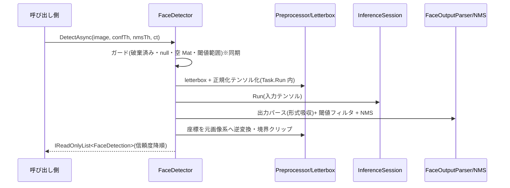

# face-detection — 設計

## 1. 概要

requirements.md の 5 要件(32 受け入れ基準)を実現する。プロジェクト骨格(src/Recognizer、tests/Recognizer.Tests)を新規作成し、公開 API `FaceDetector` と、後続 unit(object-detection、face-recognition)が再利用する共通基盤(画像入力・モデル形式判別・前処理・NMS)を `internal` として実装する。調査の詳細は [research.md](./research.md)。

### ゴール

- api-spec 3.3 のシグネチャどおりの `FaceDetector` / `FaceDetection` / `FaceLandmarks`
- ONNX メタデータと出力形状によるモデル形式の自動判別(顔検出モデル: F = 5 / 20)
- Python 非依存で `dotnet test` が自己完結するテスト基盤(fixture 方式)

### 非ゴール

- `ObjectDetector` / `FaceRecognizer`(後続 unit。ただし共通基盤は後続が再利用できる責務分割にする)
- 共通基盤の事前汎化(後続 unit で必要になった時点で拡張する。YAGNI)
- 推論性能のチューニング(SessionOptions は既定値を使う)

## 2. アーキテクチャ

### 既存システムの分析

新規プロジェクトのため対象なし(research.md 参照)。

### Boundary Map(責務境界)

依存方向は「公開 API 層 → 内部部品層」の単方向。内部部品は互いに依存せず、状態を持たない純粋関数(static)として実装する(スレッドセーフ性を無状態で担保するため)。推論セッションの状態は `FaceDetector` だけが所有する。

| コンポーネント | 層 | 責務 | 所有するデータ/振る舞い |
| -------------- | --- | ---- | ----------------------- |
| `FaceDetector` | 公開 API | 検出パイプラインの編成(入力解決 → 前処理 → 推論 → パース → NMS → 座標復元)、セッションのライフサイクル管理 | `InferenceSession`、`DetectionModelSpec`、破棄フラグ |
| `FaceDetection` / `FaceLandmarks` | 公開 API(結果型) | 検出結果の不変な表現 | BBox・信頼度・ランドマーク(データのみ、record) |
| `ImageDecoder`(internal) | 内部部品 | パス/バイト列 → `Mat` の解決と入力ガード(null・空・デコード不可) | なし(static) |
| `ModelIntrospector`(internal) | 内部部品 | ONNX メタデータから `DetectionModelSpec`(レイアウト・入力サイズ・入出力名)を判別。出力形状から形式(転置/標準、F)を判別 | なし(static) |
| `Letterbox`(internal) | 内部部品 | アスペクト比維持リサイズのパラメータ計算・座標の逆変換・画像境界クリップ | `LetterboxParams`(record、データと逆変換ロジック) |
| `Preprocessor`(internal) | 内部部品 | `Mat` → 正規化済み `DenseTensor<float>`(NCHW/NHWC、BGR→RGB、/255) | なし(static) |
| `FaceOutputParser`(internal) | 内部部品 | 出力テンソル → 候補列(bbox 中心形式→矩形、信頼度、ランドマーク)。転置/標準・F=5/20 の吸収 | なし(static) |
| `NonMaxSuppression`(internal) | 内部部品 | IoU に基づく貪欲 NMS | なし(static) |

### 技術スタック

| 領域 | 採用技術 | 理由(外部 API は使用バージョンの出典) |
| ---- | -------- | ------------------------------------- |
| ランタイム | net10.0(SDK 10.0.301) | api-spec 2.。コンテナで確認済み |
| 推論 | Microsoft.ML.OnnxRuntime 1.27.1 | api-spec 2.。NuGet 最新安定版(research.md §1)。同一セッションへの並行 `Run` は CPU EP でスレッドセーフ(公式リポジトリの一次情報: https://github.com/microsoft/onnxruntime/issues/114 、 https://github.com/microsoft/onnxruntime/discussions/10107 ) |
| 画像処理 | OpenCvSharp4 4.13.0.20260627 + OpenCvSharp4.official.runtime.linux-x64 | api-spec 2.。NuGet 最新安定版(research.md §1) |
| テスト | xunit 2.9.3 + Microsoft.NET.Test.Sdk 18.7.0 | CLAUDE.md 指定の xUnit。NuGet 最新安定版 |

## 3. File Structure Plan

| ファイルパス | 区分 | 責務 |
| ------------ | ---- | ----- |
| `Recognizer.sln` | 新規 | ソリューション定義(src / tests の 2 プロジェクト) |
| `src/Recognizer/Recognizer.csproj` | 新規 | net10.0・nullable 有効・依存パッケージ定義・`InternalsVisibleTo("Recognizer.Tests")` |
| `src/Recognizer/FaceDetector.cs` | 新規 | 公開 API。コンストラクタ(モデルロード+形式判別)、`DetectAsync` 3 オーバーロード、`Dispose` |
| `src/Recognizer/FaceDetection.cs` | 新規 | 検出結果 record(BBox・Confidence・Landmarks) |
| `src/Recognizer/FaceLandmarks.cs` | 新規 | ランドマーク 5 点 record |
| `src/Recognizer/Internal/ImageDecoder.cs` | 新規 | パス/バイト列→Mat 解決、入力ガード(null・空・デコード不可) |
| `src/Recognizer/Internal/TensorLayout.cs` | 新規 | enum(Nchw / Nhwc) |
| `src/Recognizer/Internal/DetectionModelSpec.cs` | 新規 | モデル仕様 record(レイアウト・入力サイズ・入出力名) |
| `src/Recognizer/Internal/ModelIntrospector.cs` | 新規 | 入力メタデータ→`DetectionModelSpec` 判別、出力形状→(転置/標準、F)判別、非対応形式の検出 |
| `src/Recognizer/Internal/Letterbox.cs` | 新規 | `LetterboxParams` record(scale・pad)+ 逆変換・境界クリップ |
| `src/Recognizer/Internal/Preprocessor.cs` | 新規 | Mat→letterbox→正規化テンソル(NCHW/NHWC) |
| `src/Recognizer/Internal/FaceOutputParser.cs` | 新規 | 出力テンソル→候補列(閾値フィルタ含む)。同ファイルに internal な候補 struct を置く(CLAUDE.md の「1 ファイル 1 クラス」はパブリック型が対象のため internal 型の同居は許容) |
| `src/Recognizer/Internal/NonMaxSuppression.cs` | 新規 | IoU 計算と貪欲 NMS |
| `tests/Recognizer.Tests/Recognizer.Tests.csproj` | 新規 | xUnit テストプロジェクト(src を参照) |
| `tests/Recognizer.Tests/FaceDetectorTests.cs` | 新規 | 公開 API 契約のテスト(検出・オーバーロード・例外系・キャンセル・並行・Dispose) |
| `tests/Recognizer.Tests/ModelIntrospectorTests.cs` | 新規 | 形式判別(NCHW/NHWC・動的軸・転置/標準・F=5/20・非対応)のテスト |
| `tests/Recognizer.Tests/LetterboxTests.cs` | 新規 | 逆変換・境界クリップのテスト |
| `tests/Recognizer.Tests/NonMaxSuppressionTests.cs` | 新規 | IoU・NMS のテスト |
| `tests/Recognizer.Tests/Fixtures/`(*.onnx 6 種 + README.md) | 新規 | テスト用ダミーモデル(生成物、各数 KB)と生成手順の説明 |
| `tools/generate_test_models.py` | 新規 | fixture 生成スクリプト(venv + onnx。再生成時のみ使用) |

## 4. システムフロー

## 5. Requirements Traceability(要件トレーサビリティ)

| 要件 ID | 要件内容(requirements.md より転記) | 設計要素(コンポーネント/ファイル) | 根拠・備考 |
| ------- | ---------------------------------- | --------------------------------- | ---------- |
| 1.1 | `OpenCvSharp.Mat`(BGR)を `DetectAsync` の画像入力として受け付ける | `FaceDetector.DetectAsync(Mat, ...)` | 基準オーバーロード |
| 1.2 | ファイルパスオーバーロードは OpenCV の自動判別で読み込み、Mat 入力と同一の検出契約で処理 | `FaceDetector.DetectAsync(string, ...)` → `ImageDecoder` | `Cv2.ImRead` で読み込み後、Mat 版へ委譲 |
| 1.3 | バイト列オーバーロードは自動判別でデコードし、Mat 入力と同一の検出契約で処理 | `FaceDetector.DetectAsync(ReadOnlyMemory<byte>, ...)` → `ImageDecoder` | `Cv2.ImDecode` で復号後、Mat 版へ委譲 |
| 1.4 | パス不正・デコード不可の場合 `ArgumentException` | `ImageDecoder`(ガード) | §8 エラーハンドリング |
| 1.5 | 空の Mat の場合 `ArgumentException` | `ImageDecoder`(ガード) | `Mat.Empty()` で判定 |
| 1.6 | null の Mat / imagePath の場合 `ArgumentNullException` | `FaceDetector`(ガード)+ `ImageDecoder` | `ArgumentNullException.ThrowIfNull` |
| 2.1 | コンストラクタで ONNX メタデータから入力レイアウト(NCHW/NHWC)と入力サイズを判別 | `FaceDetector` コンストラクタ → `ModelIntrospector` | 判別規則は §6 |
| 2.2 | 入力サイズが動的軸なら 640x640 を既定使用 | `ModelIntrospector` | §6 判別規則 (c) |
| 2.3 | 出力の転置 `[1,F,N]` / 標準 `[1,N,F]`、F=5 / F=20 を自動判別 | `ModelIntrospector`(静的形状)+ `FaceOutputParser`(実形状) | §6 判別規則 (d)(e) |
| 2.4 | モデルファイル不存在の場合 `FileNotFoundException` | `FaceDetector` コンストラクタ(ガード) | `File.Exists` 検査 |
| 2.5 | モデルロード失敗の場合 OnnxRuntime の例外をそのまま送出 | `FaceDetector` コンストラクタ | `InferenceSession` 構築時の例外を包まない |
| 2.6 | 形式を判別できない場合 `NotSupportedException` | `ModelIntrospector` | §6 判別規則 (f) |
| 2.7 | null の modelPath の場合 `ArgumentNullException` | `FaceDetector` コンストラクタ(ガード) | `ArgumentNullException.ThrowIfNull` |
| 3.1 | `confidenceThreshold` 未満の候補を除外 | `FaceOutputParser` | パース時にフィルタ |
| 3.2 | `nmsThreshold` による NMS 適用後の検出のみ返す | `NonMaxSuppression` | 貪欲 NMS(§6) |
| 3.3 | 信頼度降順の `IReadOnlyList<FaceDetection>` で返す | `FaceDetector`(パイプライン終端で整列) | NMS 前の降順ソートを最終結果まで維持 |
| 3.4 | 検出 0 件は空リスト(例外にしない) | `FaceDetector` | 空配列を返す。事後条件(§6) |
| 3.5 | BBox は入力画像のピクセル座標(左上原点)の `RectangleF` | `Letterbox`(逆変換) | 中心形式→左上形式変換は `FaceOutputParser` |
| 3.6 | F=20 のとき 5 点の `FaceLandmarks` を含める | `FaceOutputParser` | ランドマーク各点の conf は型に無いため破棄 |
| 3.7 | F=5 のとき `Landmarks` は null | `FaceOutputParser` | |
| 3.8 | 既定値 `confidenceThreshold=0.7` / `nmsThreshold=0.5` | `FaceDetector.DetectAsync` シグネチャ | api-spec 3.3 の既定引数 |
| 3.9 | 閾値が 0.0〜1.0 の範囲外の場合 `ArgumentException` | `FaceDetector`(ガード) | 承認済み前提(requirements) |
| 4.1 | すべての非同期メソッドで `CancellationToken`(省略可)を受け取る | `FaceDetector.DetectAsync` シグネチャ | |
| 4.2 | キャンセル要求時 `OperationCanceledException` で中断 | `FaceDetector`(パイプライン各段で `ThrowIfCancellationRequested`) | §6 契約。ORT の `Run` 中は中断不可(§10 制約) |
| 4.3 | 同一インスタンスへの並行 `DetectAsync` が単独時と同一結果 | 無状態な内部部品 + ORT セッションのスレッドセーフ性 | 根拠: research.md §2(公式リポジトリ一次情報) |
| 4.4 | `IDisposable` を実装し `Dispose` でセッション解放 | `FaceDetector.Dispose` | |
| 4.5 | Dispose 済みインスタンスへの検出呼び出しは `ObjectDisposedException` | `FaceDetector`(ガード) | 承認済み前提(requirements) |
| 5.1 | 名前空間 `Recognizer`、公開型は 3 型に限定 | 全ファイル + `Internal/` 配下は internal | テストで公開型を検査 |
| 5.2 | 内部実装(前処理・テンソル変換・NMS・出力パース)を internal に | `src/Recognizer/Internal/` 一式 | `InternalsVisibleTo` はテスト専用 |
| 5.3 | コンソール出力・ログ出力をしない | 全実装(禁止事項) | レビュー観点 + `Console.` の不使用 |
| 5.4 | 依存は Microsoft.ML.OnnxRuntime と OpenCvSharp4(+ runtime)に限定 | `Recognizer.csproj` | §2 技術スタックの 4 パッケージのみ |
| 5.5 | `src/Recognizer` / `tests/Recognizer.Tests` 構成で `dotnet build` / `dotnet test` が終了コード 0 | `Recognizer.sln` + 両 csproj | CI 相当の検証コマンド |

## 6. コンポーネントとインターフェース

### FaceDetector(公開)

- **依存(inbound)**: ライブラリ利用者
- **依存(outbound)**: `ImageDecoder`、`ModelIntrospector`、`Preprocessor`、`FaceOutputParser`、`NonMaxSuppression`、`Letterbox`
- **外部依存(external)**: Microsoft.ML.OnnxRuntime(`InferenceSession`)、OpenCvSharp4(`Mat`)
- **インターフェース/契約**:
  - `FaceDetector(string modelPath)`
    - 事前条件: `modelPath` が null でない(違反: `ArgumentNullException`)。ファイルが存在する(違反: `FileNotFoundException`)。判別可能な顔検出モデルである(違反: `NotSupportedException`。ロード自体の失敗は ORT 例外を透過)。
    - 事後条件: 推論可能な状態(`DetectionModelSpec` 確定・セッション保持)になる。
  - `DetectAsync(Mat image, float confidenceThreshold = 0.7f, float nmsThreshold = 0.5f, CancellationToken cancellationToken = default)`(string / `ReadOnlyMemory<byte>` の同形オーバーロードあり)
    - 事前条件: 未破棄(違反: `ObjectDisposedException`)。`image` が null でない(`ArgumentNullException`)・空でない(`ArgumentException`)。パス/バイト列はデコード可能(違反: `ArgumentException`)。両閾値が 0.0〜1.0(違反: `ArgumentException`)。引数ガードは同期的に検査し、呼び出し時点で送出する。
    - 事後条件: 信頼度降順・NMS 適用済み・全座標が画像境界内の `IReadOnlyList<FaceDetection>` を返す。検出 0 件は空リスト。キャンセル時は `OperationCanceledException`(派生含む)。
    - 実装方針: CPU 束縛のパイプラインを `Task.Run` で包み、`ConfigureAwait(false)` を徹底する。キャンセルは前処理前・推論前・後処理前の各チェックポイントで検査する。
- **不変条件**: 破棄後は推論不能(フラグで強制)。`DetectionModelSpec` は構築後に変化しない。

### ModelIntrospector(internal)— モデル形式の判別規則(api-spec 3.2 の確定)

- (a) 入力はテンソル 1 個・rank 4 を要求する。チャネル軸(値 3)の位置で判別: `[N,3,H,W]` → NCHW、`[N,H,W,3]` → NHWC。両形に一致する場合(H=W=3 等の病的形状)は NCHW を優先する。
- (b) 入力サイズは静的軸ならその値(H, W)。
- (c) H または W が動的軸(値 ≤ 0 または未確定)なら 640x640 を既定とする。
- (d) 出力(先頭出力)は rank 3・先頭次元 1 を要求する。`(d1, d2) = (shape[1], shape[2])` について: d1 のみが {5, 20} に一致 → 転置形式(F = d1)。d2 のみが一致 → 標準形式(F = d2)。両方一致 → 転置形式を優先(YOLO 系エクスポートの主流。research.md §4)。
- (e) 出力形状が動的軸を含む場合は構築時の確定を保留し、初回 `Run` の実形状で (d) を適用する(`FaceOutputParser` 側で判定)。
- 判別の責務分担: 構築時の (d) は非対応形式の早期検出(要件 2.6)のためのもの。パースに用いる転置/標準・F の確定は、常に `Run` 後の実形状に (d) を適用した結果を正とする(静的形状と実形状は ORT の契約上一致するため矛盾しない)。
- (f) 上記のいずれにも当てはまらない場合(入力 rank ≠ 4・チャネル軸不明・出力 rank ≠ 3・F が {5, 20} 外・出力が複数で判別不能)は `NotSupportedException`(要件 2.6)。出力が複数あるモデル(YOLOv3 系)はスコープ外のため非対応とする。
- 事後条件: `DetectionModelSpec { Layout, InputWidth, InputHeight, InputName, OutputName }` を返す。

### Preprocessor / Letterbox(internal)

- 前処理: letterbox(アスペクト比維持リサイズ + 余白パディング、パディング値 114)→ BGR→RGB → float32 /255 正規化 → `DenseTensor<float>`(モデルのレイアウトに従い NCHW または NHWC)。YOLO 系の標準前処理(research.md §4)。
- `LetterboxParams { Scale, PadX, PadY }` が座標逆変換を所有: `original = (letterboxed - pad) / scale`。逆変換後に `[0, width] × [0, height]` へクリップする(承認済み前提)。
- 事前条件: 入力 Mat は非 null・非空(上流でガード済みのため再検査しない)。事後条件: テンソル形状はモデル仕様と一致する。

### FaceOutputParser(internal)

- 出力テンソルから候補を読み出す。レイアウト吸収(転置/標準)、bbox 中心形式 `(cx, cy, w, h)` → 左上形式 `RectangleF`、信頼度フィルタ(要件 3.1)、F=20 のときランドマーク 5 点の読み出し(各点の conf は破棄。型に存在しないため)。
- 事後条件: 候補列の信頼度はすべて `confidenceThreshold` 以上。

### NonMaxSuppression(internal)

- 信頼度降順に整列し、採用済み矩形との IoU が `nmsThreshold` を超える候補を抑制する貪欲法。顔検出は単一クラスのため矩形集合全体に適用する。
- 事後条件: 返却順は信頼度降順(要件 3.3 はこの順序を終端まで維持して満たす)。

## 7. データモデル

すべて公開結果型は不変な record(api-spec 3.3 のシグネチャどおり)。

- `FaceDetection(RectangleF BBox, float Confidence, FaceLandmarks? Landmarks)`
  - 不変条件: `Confidence` は 0.0〜1.0(モデル出力は sigmoid 済み信頼度)。`BBox`・ランドマーク座標は入力画像境界内。
  - 強制方法: 生成箇所をパイプライン終端(逆変換・クリップ後)に限定する。record は init-only で生成後の変更を型で表現不能にする。ライブラリ外からの生成は妨げない(record の公開コンストラクタは api-spec の型定義そのもの)ため、不変条件の強制はライブラリが生成する値に対する事後条件として扱う。
- `FaceLandmarks(PointF LeftEye, PointF RightEye, PointF Nose, PointF LeftMouth, PointF RightMouth)`: データのみ。
- `DetectionModelSpec`(internal record): 構築時に確定し不変。
- ロジックの所在: 座標変換は `Letterbox`、IoU/NMS は `NonMaxSuppression` に集約し、`FaceDetector` は編成のみ行う(計算ロジックの重複を作らない)。純粋性優先の判断: 内部部品はプロセス外依存(セッション)を持たない純粋関数とし、副作用(推論)は `FaceDetector` に隔離する。

## 8. エラーハンドリング

api-spec 3.6 の方針に従う。予期されるエラー(検出 0 件)は結果型、契約違反は例外。

| 異常系 | 例外/結果 | 検査箇所 | 対応要件 |
| ------ | --------- | -------- | -------- |
| 検出 0 件 | 空リスト(正常返却) | パイプライン終端 | 3.4 |
| `modelPath` / `image` / `imagePath` が null | `ArgumentNullException` | 各公開メソッドの同期ガード | 1.6, 2.7 |
| モデルファイル不存在 | `FileNotFoundException` | コンストラクタ | 2.4 |
| モデルロード失敗 | ORT の例外を透過(包まない) | コンストラクタ | 2.5 |
| 非対応のモデル形式 | `NotSupportedException` | `ModelIntrospector`(構築時)/ `FaceOutputParser`(動的形状の初回 Run 時) | 2.6 |
| 画像デコード不可・パス不正 | `ArgumentException` | `ImageDecoder` | 1.4 |
| 空の Mat | `ArgumentException` | `ImageDecoder` | 1.5 |
| 閾値範囲外(0.0〜1.0 外) | `ArgumentException` | 公開メソッドの同期ガード | 3.9 |
| Dispose 後の呼び出し | `ObjectDisposedException` | 公開メソッドの同期ガード | 4.5 |
| キャンセル要求 | `OperationCanceledException` | パイプラインのチェックポイント | 4.2 |

## 9. テスト戦略

- **テスト用モデルの供給(api-spec 4. で設計確定とされた項目)**: 案 A「生成スクリプト + 生成物コミット」を採用する(選択肢の比較は research.md §3)。
  - `tools/generate_test_models.py`(Python + onnx、venv で実行)が、**入力に依存しない定数出力**を返す最小 ONNX グラフを生成する。出力値はスクリプト内の定数なので、テストの期待値を決定論的に記述できる。
  - 生成物(各数 KB)を `tests/Recognizer.Tests/Fixtures/` にコミットする。`dotnet test` は Python 非依存で自己完結する。`.gitignore` の `models/*.onnx` は実モデル置き場の規則であり fixture には適用しない(この解釈は design 承認ゲートで確認)。
  - fixture 一覧(6 種): ① NCHW・転置 `[1,5,N]`(F=5)/ ② NCHW・転置 `[1,20,N]`(F=20、ランドマーク付き)/ ③ NCHW・標準 `[1,N,5]` / ④ NHWC 入力・転置 F=5 / ⑤ 動的軸入力(640 既定の検証)/ ⑥ 非対応形式(F=7。`NotSupportedException` の検証)。定数出力には、閾値フィルタ・NMS 抑制・降順整列を 1 度に検証できる重複矩形・低信頼度候補を含める。
- **単体テスト(TDD 対象)**: 内部部品(`ModelIntrospector`・`Letterbox`・`NonMaxSuppression`)は `InternalsVisibleTo` で直接テストする(座標逆変換・クリップ・IoU は数値例で検証)。
- **公開 API 契約テスト**: fixture モデルで `FaceDetector` の受け入れ基準を検証する(オーバーロード同一性・例外系・空リスト・降順・ランドマーク有無・キャンセル・並行呼び出し・Dispose)。並行テストは同一インスタンスへの `Task.WhenAll` で単独実行と同一結果を検証する。
- **モック境界**: モックは使わない。非決定性の境界(ONNX モデル)は定数出力 fixture で決定論化する(時刻依存なし)。
- **実モデルでの動作確認**: 自動テストには含めない(ネットワーク・ライセンス依存のため。research.md §3 案 C の不採用理由)。実モデル検証は unit 完了後に人間が `models/` 配下で任意に行う。

## 10. その他

- **セキュリティ/信頼境界**: 外部入力はモデルファイルと画像。いずれも呼び出し側のローカル資源であり、ネットワーク・権限昇格・機微データの境界を持たない(STRIDE 分析の対象となる信頼境界なし)。不正入力は §8 のガードで拒否する。
- **キャンセルの制約**: `InferenceSession.Run` は実行中の中断手段を公開していないため、キャンセルはチェックポイント方式(推論前後)とする。推論中のキャンセル要求は推論完了後に検査され送出される(要件 4.2 は「中断して送出」を満たすが、推論 1 回分の遅延があり得る)。
- **並行性**: 内部部品は無状態、セッションは並行 `Run` 安全(research.md §2)。よってロックは導入しない。

## 11. 参考資料

- [research.md](./research.md) — バージョン確認・スレッドセーフ性の出典・fixture 方式の比較
- `docs/api-spec.md` — 公開 API 仕様(正)
- ONNX Runtime C# API: https://onnxruntime.ai/docs/api/csharp/api
