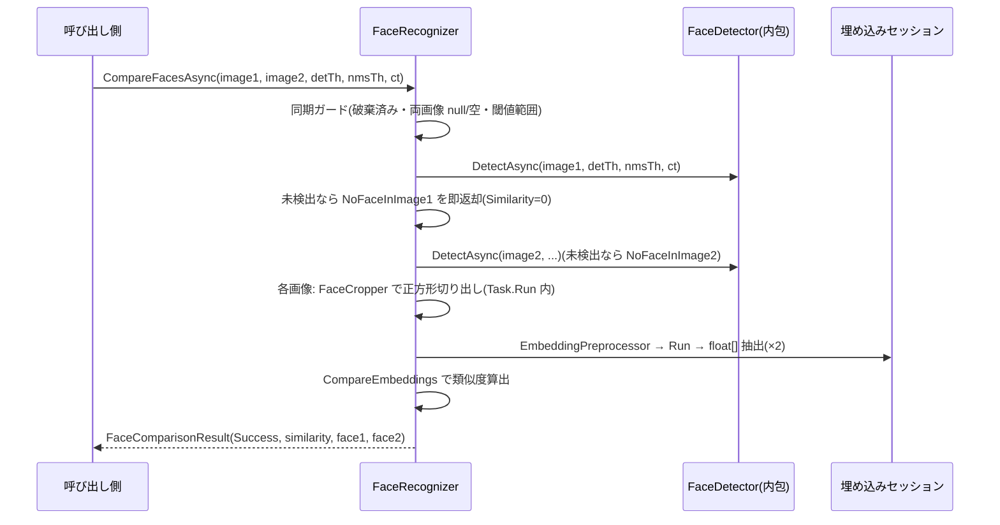

# face-recognition — 設計

## 1. 概要

requirements.md の 7 要件(44 受け入れ基準)を実現する。`FaceDetector` を内包して顔検出を再利用し、埋め込みモデル固有の要素(形式判別・正方形切り出し・ArcFace 系前処理・コサイン類似度)を追加して、公開 API `FaceRecognizer` / `FaceComparisonStatus` / `FaceComparisonResult` / `FaceEmbeddingResult` を提供する。これで api-spec の全公開型(9 型)が揃う。Gap 分析と一次情報は [research.md](./research.md)。

### ゴール

- api-spec 3.4 のシグネチャどおりの公開 4 型
- 埋め込みモデルの自動判別(入力レイアウト/サイズ・出力 `[D]` / `[1,D]`)と ArcFace 系標準前処理(一次情報準拠)
- 既存公開契約・全 138 テストの非回帰(FaceDetector / ObjectDetector のソースは変更しない。ModelIntrospector は追加 + 既定サイズ引数化のみ)

### 非ゴール

- 顔アライメント(ランドマークによる回転補正)— api-spec スコープ外(research.md §2 に精度上の含意を記録)
- 検出パイプラインの共通基盤化 — research.md §3 案 C の不採用理由どおり
- 実モデル(ArcFace 配布物)での自動テスト — 既存方針どおり fixture で決定論化

## 2. アーキテクチャ

### 既存システムの分析

research.md §1(再利用資産)・§3(FaceDetector 内包の決定)。

### Boundary Map(責務境界)

依存方向は「公開 API 層 → 公開 FaceDetector(内包)+ 内部部品層」の単方向。追加分のみ記す。

| コンポーネント | 層 | 責務 | 所有するデータ/振る舞い |
| -------------- | --- | ---- | ----------------------- |
| `FaceRecognizer` | 公開 API | 比較・抽出パイプラインの編成(同期ガード → 検出(内包 FaceDetector)→ 切り出し → 埋め込み推論 → 結果構築)、`CompareEmbeddings`(static)、両セッションのライフサイクル | `FaceDetector`(内包・所有)、埋め込み `InferenceSession`、`EmbeddingModelSpec`、破棄フラグ |
| `FaceComparisonStatus` / `FaceComparisonResult` / `FaceEmbeddingResult` | 公開 API(結果型) | 比較・抽出結果の不変な表現(api-spec 3.4 と文字単位一致) | データのみ |
| `FaceCropper`(新規 internal) | 内部部品 | 対象矩形 → 中心保持の正方形(辺長 = 長辺 × 1.4)→ `Letterbox.ClampToBounds` でクリップ → Mat の ROI 切り出し。faceRegion の妥当性検査(空・非交差 → ArgumentException) | なし(static) |
| `EmbeddingPreprocessor`(新規 internal) | 内部部品 | 切り出し Mat → 単純リサイズ(モデル入力サイズ)→ BGR→RGB → `(x−127.5)/128` 正規化 → NCHW/NHWC の `DenseTensor<float>` | なし(static) |
| `EmbeddingModelSpec`(新規 internal record) | 内部部品 | 埋め込みモデル仕様(Layout・InputWidth/Height・入出力名・`Dimension`) | 構築後不変 |
| `ModelIntrospector`(拡張) | 内部部品 | 追加: `IntrospectEmbedding`(入力判別は既存 private 共通部を既定サイズ 112 で再利用、出力 `[D]`/`[1,D]` 判別)。既定サイズの引数化(既存呼び出しは 640 で挙動不変) | なし(static) |

- コサイン類似度の計算は `FaceRecognizer.CompareEmbeddings`(public static)自体に置く(api-spec がこの位置を定めるため。internal ヘルパへの二重化はしない)。

### 技術スタック

unit 1 と同一(依存パッケージ追加なし — 要件 7.4)。埋め込み前処理の出典: research.md §2(InsightFace onnx_ijbc.py / OpenVINO model zoo)。

## 3. File Structure Plan

| ファイルパス | 区分 | 責務 |
| ------------ | ---- | ----- |
| `src/Recognizer/FaceRecognizer.cs` | 新規 | 公開 API。コンストラクタ(2 モデル)、CompareFacesAsync / ExtractEmbeddingAsync 各 3 オーバーロード、CompareEmbeddings(static)、Dispose |
| `src/Recognizer/FaceComparisonStatus.cs` | 新規 | 公開 enum(Success / NoFaceInImage1 / NoFaceInImage2) |
| `src/Recognizer/FaceComparisonResult.cs` | 新規 | 公開 record(Status, Similarity, Face1, Face2) |
| `src/Recognizer/FaceEmbeddingResult.cs` | 新規 | 公開 record(Embedding, Face) |
| `src/Recognizer/Internal/FaceCropper.cs` | 新規 | 正方形化・クリップ・ROI 切り出し・faceRegion 検査 |
| `src/Recognizer/Internal/EmbeddingPreprocessor.cs` | 新規 | リサイズ・正規化・テンソル化 |
| `src/Recognizer/Internal/EmbeddingModelSpec.cs` | 新規 | 埋め込みモデル仕様 record |
| `src/Recognizer/Internal/ModelIntrospector.cs` | 変更 | `IntrospectEmbedding` 追加・入力判別の既定サイズ引数化(既存挙動不変) |
| `tools/generate_test_models.py` | 変更 | 入力依存 fixture(⑰〜㉑)の builder 追加(既存 fixture のバイト列不変) |
| `tests/Recognizer.Tests/Fixtures/`(*.onnx 5 種 + README 追記) | 新規/変更 | §9 の fixture ⑰〜㉑ |
| `tests/Recognizer.Tests/FaceRecognizerTests.cs` | 新規 | 公開 API 契約のテスト |
| `tests/Recognizer.Tests/ModelIntrospectorTests.cs` | 変更 | `IntrospectEmbedding` の判別・非対応分岐テスト追加(既存テスト不変) |
| `tests/Recognizer.Tests/PublicApiTests.cs` | 変更 | 公開型の期待集合を 9 型へ更新・内部型検査に追加 3 型 |

## 4. システムフロー

`ExtractEmbeddingAsync` は同フローの単画像版(faceRegion 指定時は検出をスキップし FaceCropper へ直行)。

## 5. Requirements Traceability(要件トレーサビリティ)

| 要件 ID | 要件内容(requirements.md より転記・要旨) | 設計要素 | 根拠・備考 |
| ------- | ---------------------------------- | -------- | ---------- |
| 1.1 | Mat(BGR)を両 API の入力として受け付ける | `FaceRecognizer.CompareFacesAsync(Mat, Mat, ...)` / `ExtractEmbeddingAsync(Mat, ...)` | 基準オーバーロード |
| 1.2 | パス版は自動判別読み込みで Mat 版と同一契約 | オーバーロード → `ImageDecoder.DecodeFile`(再利用) | 既存実装で担保(`ImageDecoder.cs`・unit 1 でテスト済み)+ 本 unit の契約テスト |
| 1.3 | バイト列版も同一契約 | オーバーロード → `ImageDecoder.DecodeBytes`(再利用) | 同上 |
| 1.4 | パス不正・デコード不可 → ArgumentException | `ImageDecoder`(再利用) | 同上 |
| 1.5 | 空 Mat → ArgumentException | `ImageDecoder.EnsureValid`(再利用) | 同上 |
| 1.6 | null Mat / imagePath → ArgumentNullException(2 画像とも) | `FaceRecognizer` 同期ガード + `ImageDecoder` | image2 も呼び出し時点で同期検証(research.md §3) |
| 2.1 | 2 モデルの判別(検出=既存規則、埋め込み=メタデータ) | コンストラクタ → `new FaceDetector(...)`(内包)+ `ModelIntrospector.IntrospectEmbedding` | |
| 2.2 | 埋め込み入力の動的軸 → 既定サイズ(112) | `IntrospectEmbedding`(既定 112。出典: research.md §2) | 検出側 640 は FaceDetector 内で担保済み |
| 2.3 | 出力を 1 次元ベクトルとして判別し次元数を確定 | `IntrospectEmbedding`(規則は §6) | `EmbeddingModelSpec.Dimension` |
| 2.4 | いずれかのモデル不存在 → FileNotFoundException | コンストラクタ(ガード。検出側は FaceDetector が送出) | |
| 2.5 | ロード失敗 → ORT 例外透過 | コンストラクタ | 包まない |
| 2.6 | 判別不能 → NotSupportedException | `IntrospectEmbedding` / FaceDetector(検出側) | §6 規則 (e-d) |
| 2.7 | null modelPath(いずれか)→ ArgumentNullException | コンストラクタ(両引数を先頭で検査) | |
| 3.1 | 省略時は検出して最高信頼度の顔を使用 | `FaceRecognizer` → FaceDetector.DetectAsync の先頭要素 | 降順契約(unit 1)で担保 |
| 3.2 | Face に使用した検出結果を設定 | `FaceRecognizer`(結果構築) | |
| 3.3 | faceRegion 指定時は検出せず Face=null | `FaceRecognizer`(分岐)+ `FaceCropper` | |
| 3.4 | 切り出しは中心保持の正方形(長辺×1.4・境界クリップ)。faceRegion にも同一規則 | `FaceCropper`(`Letterbox.ClampToBounds` 再利用) | 承認済み前提 |
| 3.5 | 未検出 → Embedding/Face とも null(例外なし) | `FaceRecognizer` | 結果型契約 |
| 3.6 | Embedding は次元数どおりの float[] | `FaceRecognizer`(Run 出力の抽出)+ `EmbeddingModelSpec.Dimension` | |
| 3.7 | faceRegion 空・非交差 → ArgumentException | `FaceCropper`(検査。同期) | |
| 3.8 | 既定値 0.7 / 0.5 | `ExtractEmbeddingAsync` シグネチャ | api-spec 3.4 |
| 3.9 | 閾値範囲外 → ArgumentException(faceRegion 指定時も) | `FaceRecognizer` 同期ガード | 常時ガード契約 |
| 4.1 | 各画像の最高信頼度の顔で類似度算出(Success) | `FaceRecognizer.CompareFacesAsync` | §4 フロー |
| 4.2 | Face1/Face2 に使用した顔を設定 | 同上 | |
| 4.3 | 画像 1 未検出 → NoFaceInImage1・Similarity=0・Face1=null(両方未検出も同) | 同上(画像 1 を先に評価) | 承認済み前提 |
| 4.4 | 画像 2 未検出 → NoFaceInImage2・Similarity=0・Face2=null | 同上 | |
| 4.5 | 同一人物判定をしない | 公開面に判定 API を置かない(結果は類似度のみ) | contract 検査 |
| 4.6 | 既定値 0.7 / 0.5 | `CompareFacesAsync` シグネチャ | |
| 4.7 | 閾値範囲外 → ArgumentException | 同期ガード | |
| 5.1 | CompareEmbeddings は static でコサイン類似度を返す | `FaceRecognizer.CompareEmbeddings` | api-spec 3.4 |
| 5.2 | 値域 [-1,1](誤差はクランプ) | 同上(Math.Clamp) | |
| 5.3 | 次元不一致 → ArgumentException | 同上(ガード) | api-spec 3.4 |
| 5.4 | ゼロベクトル → 0 | 同上 | 承認済み前提 |
| 5.5 | 同一=1.0 / 逆向き=-1.0(許容誤差内) | 同上 | テストは epsilon=1e-5 |
| 6.1 | 全非同期メソッドで CancellationToken 省略可 | 両 API のシグネチャ | |
| 6.2 | キャンセル → OperationCanceledException | 同期ガード後の各段チェックポイント + FaceDetector 内包分 | §10 |
| 6.3 | 並行呼び出しで単独時と同一結果 | 無状態部品 + 両セッションの並行 Run 安全(unit 1 の一次情報と同根拠) | |
| 6.4 | IDisposable。Dispose で両セッション解放 | `Dispose`(内包 FaceDetector.Dispose + 埋め込みセッション Dispose) | |
| 6.5 | Dispose 後 → ObjectDisposedException | 同期ガード | 承認済み前提 |
| 7.1 | 追加公開型は 4 型のみ(計 9 型) | 公開ファイル 4 + `PublicApiTests` 期待集合更新 | |
| 7.2 | シグネチャは api-spec 3.4 と一致 | 全公開ファイル | contract 検査・文字単位一致 |
| 7.3 | 追加内部実装は internal | `Internal/` 3 ファイル | |
| 7.4 | Console/ログなし・依存不変 | 全実装 + 既存 `PublicApiTests` | |
| 7.5 | 既存テスト含め build/test 終了コード 0 | ソリューション全体 | 非回帰(既存 138) |

## 6. コンポーネントとインターフェース

### FaceRecognizer(公開)

- **依存(outbound)**: `FaceDetector`(内包)、`ImageDecoder`、`FaceCropper`、`EmbeddingPreprocessor`、`ModelIntrospector`、`Letterbox`(FaceCropper 経由)
- **契約**(api-spec 3.4 と文字単位一致):
  - `FaceRecognizer(string detectorModelPath, string embeddingModelPath)`
    - 事前条件: 両パス非 null(違反: `ArgumentNullException`。両引数を先頭で検査してから重い処理に入る)。両ファイル存在(違反: `FileNotFoundException`)。判別可能(違反: `NotSupportedException`。ロード失敗は ORT 透過)。
    - 事後条件: 検出・埋め込みの両方が推論可能。**部分構築の禁止**: 埋め込み側の構築が失敗した場合、生成済みの内包 FaceDetector を破棄してから送出する(リーク防止)。
  - `CompareFacesAsync(Mat image1, Mat image2, float detectionThreshold = 0.7f, float nmsThreshold = 0.5f, CancellationToken cancellationToken = default)` / `ExtractEmbeddingAsync(Mat image, RectangleF? faceRegion = null, float detectionThreshold = 0.7f, float nmsThreshold = 0.5f, CancellationToken cancellationToken = default)`(string / `ReadOnlyMemory<byte>` の同形オーバーロードあり)
    - 事前条件: 未破棄・全画像引数の null/空検査・閾値範囲 [0,1]・faceRegion の妥当性(指定時)— **すべて呼び出し時点で同期送出**(検出結果に依存しない検査を検出より先に完了させる)。
    - 事後条件: 要件 3.x / 4.x の結果型契約。予期されるエラー(顔未検出)は例外にしない。
    - 実装方針: 同期ガード → 検出(内包 FaceDetector の `DetectAsync` を await、`ConfigureAwait(false)`)→ 未検出の早期返却 → `Task.Run` 内で切り出し・前処理・埋め込み推論(前後にキャンセルチェックポイント)。オーバーロードは `ImageDecoder` で Mat 化して Mat 版へ委譲(所有 Mat は完了後破棄。unit 1・2 と同一パターン)。
  - `static float CompareEmbeddings(ReadOnlySpan<float> embedding1, ReadOnlySpan<float> embedding2)`
    - 事前条件: 長さ一致(違反: `ArgumentException`)。事後条件: [-1,1](クランプ)。ゼロベクトルは 0。
- **不変条件**: 破棄後は推論不能。`EmbeddingModelSpec` は構築後不変。

### ModelIntrospector(internal・拡張)— 埋め込みモデルの判別規則(api-spec 3.2 の確定)

- (e-a) 入力判別は既存 private 共通部(規則 a〜c)を再利用する。既定サイズは引数化し、埋め込みは **112x112**(research.md §2)、既存呼び出し(検出)は 640x640 のまま(挙動不変)。
- (e-b) 出力は単一テンソルを要求。形状が rank 1 `[D]` または rank 2 `[1, D]`(D は静的な正値)のとき、埋め込み次元 = D と判別する。
- (e-c) 事後条件: `EmbeddingModelSpec { Layout, InputWidth, InputHeight, InputName, OutputName, Dimension }`。
- (e-d) 非対応: 複数出力・出力 rank 3 以上・rank 2 で先頭次元 ≠ 1・D が動的(≤0)・入力判別不能は `NotSupportedException`(次元は API 契約(3.6)の要であり構築時確定を必須とする。research.md §5)。

### FaceCropper(internal・新規)

- `Validate(RectangleF faceRegion, int imageWidth, int imageHeight)`: 幅・高さ ≤ 0、または画像矩形と交差しない場合 `ArgumentException`(要件 3.7)。
- `CropSquare(Mat image, RectangleF region)`: 中心保持・辺長 = `max(w, h) × 1.4` の正方形を `Letterbox.ClampToBounds` で境界クリップし、`new Mat(image, roi)`(ROI 参照)から**複製を返す**(後段のリサイズが元 Mat と独立になるよう `Clone`。呼び出し側が破棄)。クリップ後に幅・高さが 0 に退化した場合は `ArgumentException`(交差なしと同義)。
- 事後条件: 返却 Mat は非空。切り出し規則は検出 BBox・faceRegion で共通(要件 3.4)。

### EmbeddingPreprocessor(internal・新規)

- `Preprocess(Mat croppedFace, EmbeddingModelSpec spec)` → `DenseTensor<float>`:単純リサイズ(`Cv2.Resize`、`InputWidth × InputHeight`)→ BGR→RGB → `(x − 127.5f) / 128f` → Layout に応じ NCHW/NHWC。事前条件: 入力は FaceCropper の事後条件(非空)を信頼し再検査しない。
- 正規化式の出典は research.md §2(InsightFace 公式)。

## 7. データモデル

すべて api-spec 3.4 と文字単位一致(public sealed record / public enum):

- `FaceComparisonStatus`(enum): `Success` / `NoFaceInImage1` / `NoFaceInImage2`。
- `FaceComparisonResult(FaceComparisonStatus Status, float Similarity, FaceDetection? Face1, FaceDetection? Face2)`
  - 不変条件(ライブラリ生成値の事後条件): `Status = Success` ⇔ `Face1`・`Face2` 非 null。未検出時 `Similarity = 0`。`Similarity ∈ [-1, 1]`。
- `FaceEmbeddingResult(float[]? Embedding, FaceDetection? Face)`
  - 不変条件: `Embedding` 非 null のとき長さ = `EmbeddingModelSpec.Dimension`。`faceRegion` 指定時は `Face = null`。
- 生成箇所はパイプライン終端に限定。ロジックの所在: 切り出し計算は `FaceCropper`、類似度は `CompareEmbeddings` に集約(重複なし)。

## 8. エラーハンドリング

既存 unit と同一方針(api-spec 3.6)。本 unit 固有の対応表:

| 異常系 | 例外/結果 | 検査箇所 | 対応要件 |
| ------ | --------- | -------- | -------- |
| 顔未検出(抽出) | `FaceEmbeddingResult(null, null)` | パイプライン | 3.5 |
| 顔未検出(比較) | `Status = NoFaceInImage1/2`・`Similarity = 0` | パイプライン | 4.3, 4.4 |
| null 画像・null パス(いずれの引数でも) | `ArgumentNullException` | 同期ガード | 1.6 |
| null モデルパス(いずれでも) | `ArgumentNullException` | コンストラクタ | 2.7 |
| モデル不存在 / ロード失敗 / 判別不能 | `FileNotFoundException` / ORT 透過 / `NotSupportedException` | コンストラクタ(部分構築時は内包 detector を破棄) | 2.4〜2.6 |
| デコード不可・空 Mat | `ArgumentException` | `ImageDecoder`(再利用) | 1.4, 1.5 |
| faceRegion 空・非交差 | `ArgumentException` | `FaceCropper.Validate`(同期) | 3.7 |
| 閾値範囲外 | `ArgumentException` | 同期ガード | 3.9, 4.7 |
| 埋め込み次元不一致 | `ArgumentException` | `CompareEmbeddings` | 5.3 |
| Dispose 後 | `ObjectDisposedException` | 同期ガード | 6.5 |
| キャンセル | `OperationCanceledException` | チェックポイント + 内包 detector | 6.2 |

## 9. テスト戦略

- **fixture の増設**(research.md §4。生成スクリプト + 生成物コミット方式、既存 16 種のバイト列不変):
  - ⑰ `embed_nchw_meanrgb_d4`: 入力 [1,3,112,112]・出力 `[1,4]` = [mean(R), mean(G), mean(B), 1.0]。**入力依存・決定論的**。単色画像 (r,g,b) の埋め込みは正規化後 `[(r−127.5)/128, (g−127.5)/128, (b−127.5)/128, 1.0]` で解析的に計算できる。
  - ⑱ `embed_nhwc_meanrgb_d4`: NHWC 版(EmbeddingPreprocessor の詰め順検証)。
  - ⑲ `embed_dynamic_input_d4`: 入力 H/W 動的 → 112 既定の検証。
  - ⑳ `embed_unsupported_rank3`: 出力 `[1,4,4]` → NotSupportedException(規則 e-d)。
  - ㉑ `face_inputconf_f5`: 出力 [1,5,N]・bbox 定数・conf = 入力平均。白画像 → 検出、黒画像 → 未検出。**NoFaceInImage1/2・抽出未検出(3.5)の分岐検証に必須**(既存の定数出力検出 fixture では画像による検出差を作れないため)。
- **単体テスト**: `IntrospectEmbedding`(rank1/rank2・D 確定・非対応 4 分岐を 1 ガード 1 テスト)、`FaceCropper`(正方形化・クリップ・退化・非交差)、`CompareEmbeddings`(直交=0・同一=1・逆=-1・次元不一致・ゼロベクトル・クランプ)。
- **公開 API 契約テスト**(`FaceRecognizerTests`): 単色画像 2 枚(既知の埋め込み)で `CompareFacesAsync` の類似度を解析的期待値と照合。㉑で白/黒画像による Status 3 値。faceRegion 指定・未検出・オーバーロード同一性・例外系・キャンセル・並行・Dispose(1 ガード 1 テスト。null Mat は両画像分)。
- **降順ソート等の既存契約**は FaceDetector 内包により unit 1 のテストが担保(重複テストしない)。
- **非回帰**: 既存 138 テスト無改変(`PublicApiTests` の期待集合更新のみ)。全体 green を各タスクの検証条件に含める。
- モック不使用。実モデル(ArcFace)検証は unit 完了後に人間が任意に行う(アライメント無しの精度限界も含め README ではなく api-spec の範囲外)。

## 10. その他

- **信頼境界**: 既存 unit と同一(新たな境界なし)。埋め込みベクトルは生体情報由来だが、ライブラリはメモリ上で返すのみで保存・送信をしない(保存時の保護は呼び出し側の責務)。
- **キャンセル・並行性**: 既存方式(チェックポイント + セッション並行 Run 安全 + ロックなし)。内包 FaceDetector のキャンセル・並行契約は unit 1 で検証済み。
- **CompareFacesAsync の逐次検出**: 画像 1 → 画像 2 の順で検出する(並列化しない)。理由: NoFaceInImage1 の早期返却が仕様上の評価順(承認済み前提)であり、2 画像並列は複雑さに見合わない(YAGNI)。

## 11. 参考資料

- [research.md](./research.md) — Gap 分析・前処理の一次情報(InsightFace onnx_ijbc.py / OpenVINO model zoo)・fixture 方針
- `docs/api-spec.md` §3.4 — 公開 API 仕様(正)
- `docs/specs/face-detection/design.md` / `docs/specs/object-detection/design.md` — 再利用する基盤の設計(凍結済み・参照専用)
