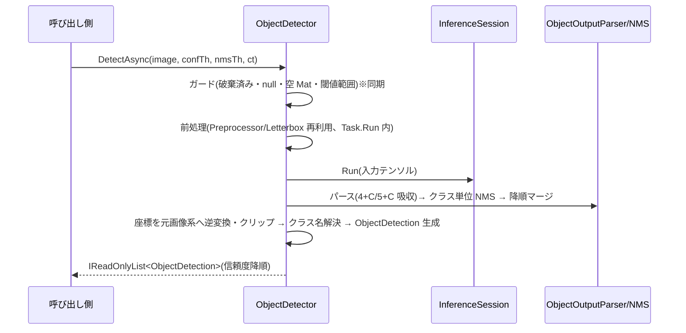

# object-detection — 設計

## 1. 概要

requirements.md の 6 要件(36 受け入れ基準)を実現する。unit face-detection の無状態 internal 部品を再利用し、物体検出固有の要素(出力判別 4+C / 5+C・クラス名解決・クラス単位 NMS)を追加して、公開 API `ObjectDetector` / `ObjectDetection` を提供する。Gap 分析と一次情報の出典は [research.md](./research.md)。

### ゴール

- api-spec 3.5 のシグネチャどおりの `ObjectDetector` / `ObjectDetection`
- YOLOv5(標準 `[1,N,F]`、F=5+C)/ YOLOv8/v11(転置 `[1,F,N]`、F=4+C)の自動判別
- 既存 unit の公開契約・全 80 テストの非回帰(FaceDetector のソースは変更しない)

### 非ゴール

- FaceDetector との共通基底クラス抽出 — 理由: 2 クラスでの抽象化は時期尚早(YAGNI)。編成の複製(各 ~90 行)を許容し、unit face-recognition 完了後に必要なら再検討する(research.md §3 案 C)
- 実モデル(Ultralytics 配布物)での自動テスト — 理由: unit face-detection と同一方針(fixture で決定論化)

## 2. アーキテクチャ

### 既存システムの分析

research.md §1〜§2 のとおり。再利用資産(変更なし): `ImageDecoder` / `Preprocessor` / `Letterbox` / `NonMaxSuppression` / `DetectionModelSpec` / `FaceDetector`(不変)。拡張(追加のみ): `ModelIntrospector`。

### Boundary Map(責務境界)

依存方向は「公開 API 層 → 内部部品層」の単方向(unit face-detection と同一)。追加分のみ記す。

| コンポーネント | 層 | 責務 | 所有するデータ/振る舞い |
| -------------- | --- | ---- | ----------------------- |
| `ObjectDetector` | 公開 API | 検出パイプラインの編成(入力解決 → 前処理 → 推論 → パース → クラス単位 NMS → 座標復元 → クラス名解決)、セッションのライフサイクル管理 | `InferenceSession`、`DetectionModelSpec`、解決済みクラス名リスト(nullable)、破棄フラグ |
| `ObjectDetection` | 公開 API(結果型) | 検出結果の不変な表現 | ClassId・ClassName・Confidence・BBox(record) |
| `ModelIntrospector`(拡張) | 内部部品 | 既存: 顔用判別(不変)。追加: `IntrospectObject`(物体用の構築時検証)と `ClassifyObjectOutput`(実形状 → 転置/標準・F・C) | なし(static) |
| `ObjectOutputParser`(新規 internal) | 内部部品 | 出力テンソル → 候補列(bbox 中心→左上、4+C: argmax / 5+C: objectness×最大クラススコア、閾値フィルタ)。候補 struct `ObjectCandidate(Box, Confidence, ClassId)` を同居 | なし(static) |
| `CocoClassNames`(新規 internal) | 内部部品 | COCO 80 クラス名(Ultralytics 標準順)の定数 | `IReadOnlyList<string>`(readonly) |

### 技術スタック

unit face-detection と同一(design.md §2 参照。依存パッケージの追加なし — 要件 6.4)。

## 3. File Structure Plan

| ファイルパス | 区分 | 責務 |
| ------------ | ---- | ----- |
| `src/Recognizer/ObjectDetector.cs` | 新規 | 公開 API。コンストラクタ(モデルロード + 物体用判別 + classNames 保持)、`DetectAsync` 3 オーバーロード、`Dispose` |
| `src/Recognizer/ObjectDetection.cs` | 新規 | 検出結果 record(api-spec 3.5 と文字単位一致) |
| `src/Recognizer/Internal/ObjectOutputParser.cs` | 新規 | 出力パース(4+C / 5+C・閾値フィルタ)。internal 候補 struct 同居 |
| `src/Recognizer/Internal/CocoClassNames.cs` | 新規 | COCO 80 クラス名の定数 |
| `src/Recognizer/Internal/ModelIntrospector.cs` | 変更 | `IntrospectObject` / `ClassifyObjectOutput` の追加。**既存メソッドのシグネチャ・挙動は不変**(入力判別部の private 共通化のみ) |
| `tools/generate_test_models.py` | 変更 | 物体用 fixture builder の追加(既存 fixture のバイト列は不変) |
| `tests/Recognizer.Tests/Fixtures/`(*.onnx 4 種 + README.md 追記) | 新規/変更 | 物体用 fixture(⑫〜⑮。§9) |
| `tests/Recognizer.Tests/ObjectDetectorTests.cs` | 新規 | 公開 API 契約のテスト(検出・クラス名・クラス単位 NMS・例外系・非同期契約) |
| `tests/Recognizer.Tests/ModelIntrospectorTests.cs` | 変更 | `ClassifyObjectOutput` / `IntrospectObject` の判別・非対応分岐テスト追加(既存テスト不変) |
| `tests/Recognizer.Tests/PublicApiTests.cs` | 変更 | 公開型の期待集合を 5 型に更新(要件 6.1) |

## 4. システムフロー

FaceDetector と同一骨格(face-detection design.md §4)。差分は「パース」が `ObjectOutputParser`、「NMS」がクラス単位、「結果構築」でクラス名解決が入る点のみ。

## 5. Requirements Traceability(要件トレーサビリティ)

| 要件 ID | 要件内容(requirements.md より転記) | 設計要素(コンポーネント/ファイル) | 根拠・備考 |
| ------- | ---------------------------------- | --------------------------------- | ---------- |
| 1.1 | `OpenCvSharp.Mat`(BGR)を `DetectAsync` の画像入力として受け付ける | `ObjectDetector.DetectAsync(Mat, ...)` | 基準オーバーロード |
| 1.2 | パス版は OpenCV 自動判別で読み込み、Mat 入力と同一の検出契約で処理 | `ObjectDetector.DetectAsync(string, ...)` → `ImageDecoder`(再利用) | FaceDetector と同一委譲パターン |
| 1.3 | バイト列版は自動判別でデコードし、Mat 入力と同一の検出契約で処理 | `ObjectDetector.DetectAsync(ReadOnlyMemory<byte>, ...)` → `ImageDecoder`(再利用) | 同上 |
| 1.4 | パス不正・デコード不可の場合 `ArgumentException` | `ImageDecoder`(再利用) | 既存実装で担保(face-detection unit で実装・テスト済み。`src/Recognizer/Internal/ImageDecoder.cs`)。本 unit では ObjectDetector 経由の契約テストを追加 |
| 1.5 | 空の Mat の場合 `ArgumentException` | `ImageDecoder.EnsureValid`(再利用) | 同上 |
| 1.6 | null の Mat / imagePath の場合 `ArgumentNullException` | `ObjectDetector`(ガード)+ `ImageDecoder`(再利用) | 同上 |
| 2.1 | コンストラクタで入力レイアウトと入力サイズを判別 | `ObjectDetector` コンストラクタ → `ModelIntrospector.IntrospectObject` | 入力判別は既存 private 共通部を再利用 |
| 2.2 | 動的軸なら 640x640 既定 | `ModelIntrospector`(既存入力判別・再利用) | 既存実装で担保(`ModelIntrospector.cs` の規則 (b)(c)。face unit でテスト済み)。物体経路の統合テストを追加 |
| 2.3 | 転置/標準、F=4+C / 5+C を自動判別 | `ModelIntrospector.ClassifyObjectOutput` | 判別規則は §6 |
| 2.4 | 5+C は信頼度 = objectness × 最大クラススコア、ClassId = argmax | `ObjectOutputParser` | §6 パース仕様 |
| 2.5 | 4+C は信頼度 = 最大クラススコア、ClassId = argmax | `ObjectOutputParser` | §6 パース仕様 |
| 2.6 | モデルファイル不存在の場合 `FileNotFoundException` | `ObjectDetector` コンストラクタ(ガード) | FaceDetector と同一パターン |
| 2.7 | ロード失敗は ORT の例外を透過 | `ObjectDetector` コンストラクタ | 包まない |
| 2.8 | 判別不能(複数出力テンソル含む)は `NotSupportedException` | `ModelIntrospector.IntrospectObject` / `ClassifyObjectOutput` | §6 規則 (o-f) |
| 2.9 | null modelPath は `ArgumentNullException` | `ObjectDetector` コンストラクタ(ガード) | |
| 3.1 | classNames 指定時は `classNames[ClassId]` で解決 | `ObjectDetector`(結果構築時のクラス名解決) | §6 クラス名解決 |
| 3.2 | 省略時、クラス数 80 なら COCO 80 クラス名 | `ObjectDetector` + `CocoClassNames` | 同上 |
| 3.3 | 省略時、80 以外なら `"class_{id}"` | `ObjectDetector` | 同上 |
| 3.4 | ClassId が classNames の範囲外なら例外にせず `"class_{id}"` | `ObjectDetector` | 承認済み前提 |
| 4.1 | `confidenceThreshold` 未満の候補を除外 | `ObjectOutputParser` | パース時フィルタ |
| 4.2 | NMS はクラス単位で適用し、適用後の検出のみ返す | `ObjectDetector`(クラス別グルーピング)+ `NonMaxSuppression`(再利用) | §6 クラス単位 NMS |
| 4.3 | 信頼度降順の `IReadOnlyList<ObjectDetection>` | `ObjectDetector`(クラス別 NMS 結果のマージ後に降順整列) | §6 |
| 4.4 | 検出 0 件は空リスト | `ObjectDetector` | 空配列返却 |
| 4.5 | `ObjectDetection(...)` の BBox は入力画像のピクセル座標(左上原点) | `Letterbox`(再利用)+ `ObjectDetector`(終端で逆変換・クリップ) | 既存実装で担保(`Letterbox.cs`。face unit でテスト済み)+ 統合テスト |
| 4.6 | 既定値 `confidenceThreshold=0.5` / `nmsThreshold=0.5` | `ObjectDetector.DetectAsync` シグネチャ | api-spec 3.5 |
| 4.7 | 閾値が 0.0〜1.0 の範囲外は `ArgumentException` | `ObjectDetector`(同期ガード) | 承認済み前提 |
| 5.1 | 全非同期メソッドで `CancellationToken`(省略可) | `ObjectDetector.DetectAsync` シグネチャ | |
| 5.2 | キャンセル要求時 `OperationCanceledException` | `ObjectDetector`(チェックポイント 3 箇所) | FaceDetector と同一方式 |
| 5.3 | 並行 `DetectAsync` が単独時と同一結果 | 無状態 internal 部品 + ORT セッションのスレッドセーフ性 | 根拠は face-detection research.md §2(一次情報) |
| 5.4 | `IDisposable` を実装し `Dispose` でセッション解放 | `ObjectDetector.Dispose` | |
| 5.5 | Dispose 済みへの検出呼び出しは `ObjectDisposedException` | `ObjectDetector`(同期ガード) | 承認済み前提 |
| 6.1 | 追加公開型は `ObjectDetector` / `ObjectDetection` のみ(計 5 型) | 全ファイル + `PublicApiTests`(期待集合更新) | |
| 6.2 | 追加の内部実装は `internal` | `Internal/ObjectOutputParser.cs` / `Internal/CocoClassNames.cs` | |
| 6.3 | コンソール出力・ログ出力をしない | 全実装(禁止事項)+ 既存 `PublicApiTests` のソース走査 | |
| 6.4 | 依存パッケージを既存構成から増やさない | `Recognizer.csproj`(変更しない)+ 既存 `PublicApiTests` | |
| 6.5 | 既存テスト含め `dotnet build` / `dotnet test` が終了コード 0 | ソリューション全体 | 非回帰(既存 80 テスト) |

## 6. コンポーネントとインターフェース

### ObjectDetector(公開)

- **依存(inbound)**: ライブラリ利用者
- **依存(outbound)**: `ImageDecoder`、`ModelIntrospector`、`Preprocessor`、`ObjectOutputParser`、`NonMaxSuppression`、`Letterbox`、`CocoClassNames`
- **外部依存(external)**: Microsoft.ML.OnnxRuntime、OpenCvSharp4
- **インターフェース/契約**(api-spec 3.5 と文字単位一致):
  - `ObjectDetector(string modelPath, IReadOnlyList<string>? classNames = null)`
    - 事前条件: `modelPath` 非 null(違反: `ArgumentNullException`)。ファイル存在(違反: `FileNotFoundException`)。判別可能な物体検出モデル(違反: `NotSupportedException`。ロード失敗は ORT 例外透過)。`classNames` は null 可・要素数の検証はしない(承認済み前提: 範囲外はフォールバック)。
    - 事後条件: 推論可能な状態になる。`classNames` の参照を保持する(防御的コピーはしない。呼び出し側が変更しない前提を doc コメントに明記)。
  - `DetectAsync(Mat image, float confidenceThreshold = 0.5f, float nmsThreshold = 0.5f, CancellationToken cancellationToken = default)`(string / `ReadOnlyMemory<byte>` の同形オーバーロードあり)
    - 事前条件・実装方針(同期ガード → `Task.Run`・`ConfigureAwait(false)`・キャンセルチェックポイント 3 箇所・Mat 所有権)は FaceDetector の DetectAsync と同一(face-detection design.md §6。編成コードは複製し、変更しない)。
    - 事後条件: 信頼度降順・クラス単位 NMS 適用済み・全座標が画像境界内・クラス名解決済みの `IReadOnlyList<ObjectDetection>`。検出 0 件は空リスト。
- **クラス単位 NMS**(要件 4.2): 閾値通過候補を `ClassId` でグルーピングし、各グループに `NonMaxSuppression.Apply` を適用、採用候補を全クラス分マージして信頼度降順に整列する。異なるクラスの検出同士は IoU にかかわらず抑制されない。
- **クラス名解決**(要件 3.x): 結果構築時に決定する。`classNames` 指定時は `0 <= ClassId < classNames.Count` なら `classNames[ClassId]`、範囲外は `"class_{ClassId}"`。省略時はクラス数 C が 80 なら `CocoClassNames.Names[ClassId]`、それ以外は `"class_{ClassId}"`。
- **不変条件**: 破棄後は推論不能。`DetectionModelSpec` は構築後不変。

### ModelIntrospector(internal・拡張)— 物体検出モデルの判別規則(api-spec 3.2 の確定)

既存の顔用規則 (a)〜(f)(face-detection design.md §6)は不変。物体用に以下を追加する。入力判別 (a)〜(c) は顔用と共通(private 共通化)。

- (o-d) 出力(単一・rank 3・先頭次元 1 を要求)の `(d1, d2) = (shape[1], shape[2])` について、**小さい方の次元を F、大きい方を N とする**(実モデルでは N ≫ F。research.md §4)。d1 = d2 の場合は転置形式(F = d1)を優先する。
- (o-e) 形式の対応: **転置形式 `[1, F, N]` = YOLOv8/v11 = `F = 4 + C`、標準形式 `[1, N, F]` = YOLOv5 = `F = 5 + C`**(Ultralytics 公式エクスポートの慣習。一次情報は research.md §4)。したがって C = 転置なら F − 4、標準なら F − 5。
- (o-f) 非対応: 出力が複数(YOLOv3 系)・入力/出力の rank 不正・チャネル軸不明・**F が転置で 5 未満または標準で 6 未満**(C ≧ 1 が成立しない)は `NotSupportedException`(要件 2.8)。
- (o-g) 出力形状が動的軸を含む場合は構築時の確定を保留し、初回 `Run` の実形状に (o-d)〜(o-f) を適用する(顔用 (e) と同じ責務分担: 構築時は早期検出用、実形状が正)。
- 追加 API: `IntrospectObject(InferenceSession)` → `DetectionModelSpec`(構築時検証)、`ClassifyObjectOutput(ReadOnlySpan<int>)` → `ObjectOutputSpec(Format, FeatureCount, CandidateCount, ClassCount, HasObjectness)`(純粋関数。Run 後の実形状判定に再利用)。
- 顔モデルとの両義性(例: F=20 は顔とも 4+16 とも解釈可能)は使用クラス側の解釈を正とする(承認済み前提)。`ClassifyObjectOutput` は {5,20} を特別扱いしない。

### ObjectOutputParser(internal・新規)

- 入力: 出力テンソル(`Tensor<float>`)と `confidenceThreshold`。`ClassifyObjectOutput` で形式を確定してから読み出す。
- 4+C(転置 = YOLOv8/v11): 特徴 = [cx, cy, w, h, class_0..class_{C-1}]。信頼度 = 最大クラススコア、ClassId = argmax(要件 2.5)。
- 5+C(標準 = YOLOv5): 特徴 = [cx, cy, w, h, objectness, class_0..class_{C-1}]。信頼度 = objectness × 最大クラススコア、ClassId = argmax(要件 2.4)。
- bbox 中心形式 → 左上形式 `RectangleF`(レターボックス空間のまま。逆変換は ObjectDetector 終端)。
- 事後条件: 候補列の信頼度はすべて `confidenceThreshold` 以上(要件 4.1)。
- 候補型 `ObjectCandidate(RectangleF Box, float Confidence, int ClassId)`(internal readonly record struct、同ファイル同居)。

### CocoClassNames(internal・新規)

- Ultralytics 標準の COCO 80 クラス名(英語・順序固定)。正本: research.md §5 の coco.yaml。
- 不変条件: 要素数 80(静的アサートとしてテストで検証)。

## 7. データモデル

- `ObjectDetection(int ClassId, string ClassName, float Confidence, RectangleF BBox)`: public sealed record(api-spec 3.5 と文字単位一致)。
  - 不変条件(ライブラリが生成する値の事後条件): `Confidence` は 0.0〜1.0、`BBox` は画像境界内、`ClassName` は非 null(解決規則 §6 により常に値を持つ)。生成箇所はパイプライン終端に限定する。
- ロジックの所在: 出力解釈(argmax・信頼度合成)は `ObjectOutputParser`、クラス単位 NMS のグルーピングとクラス名解決は `ObjectDetector` の編成に置く(1 箇所ずつ。重複を作らない)。

## 8. エラーハンドリング

face-detection design.md §8 と同一方針・同一例外契約(検出 0 件 = 空リスト / null = ArgumentNullException / 不存在 = FileNotFoundException / ロード失敗 = ORT 透過 / 非対応 = NotSupportedException / デコード不可・空 Mat・閾値範囲外 = ArgumentException / Dispose 後 = ObjectDisposedException / キャンセル = OperationCanceledException)。対応要件は §5 トレーサビリティ表(1.4〜1.6, 2.6〜2.9, 4.4, 4.7, 5.2, 5.5)。

## 9. テスト戦略

- **fixture の増設**(生成スクリプト + 生成物コミット方式を踏襲。N > F の規則で生成):
  - ⑫ `object_nchw_transposed_4c3.onnx`: `[1, 7, 60]`(4+C、C=3)。定数出力に (i) 同一クラスの重複矩形ペア(クラス単位 NMS で抑制される)、(ii) **異なるクラスの同一座標ペア(クラス単位 NMS で両方残る — 要件 4.2 の核心)**、(iii) 閾値未満候補、(iv) argmax 検証用の複数クラススコアを含める。
  - ⑬ `object_nchw_standard_5c3.onnx`: `[1, 60, 8]`(5+C、C=3、YOLOv5 形式)。objectness × 最大クラススコアの合成信頼度が既知値になる定数を入れる(要件 2.4)。
  - ⑭ `object_transposed_coco80.onnx`: `[1, 84, 100]`(C=80)。classNames 省略時に COCO 名(person 等)が解決されることの検証(要件 3.2)。
  - ⑮ `object_unsupported_f4.onnx`: `[1, 4, 60]`(F=4 → C=0)。物体用判別の `NotSupportedException`(要件 2.8)。
  - 入力レイアウト(NHWC)・動的軸は共通経路で担保済み(face unit の fixture ④⑤とテスト)のため物体用には追加しない(YAGNI)。
- **単体テスト**: `ClassifyObjectOutput`(転置/標準・F/N 識別・C 算出・d1=d2・非対応の各分岐を 1 ガード 1 テスト)、`CocoClassNames`(要素数 80・先頭/末尾の名前)。
- **公開 API 契約テスト**(`ObjectDetectorTests`): fixture ⑫〜⑮で受け入れ基準を検証(クラス単位 NMS・argmax・信頼度合成・クラス名解決 4 規則・オーバーロード同一性・例外系・キャンセル・並行・Dispose)。既存テストパターン(1 ガード 1 テスト・非正方入力での逆変換検証)を踏襲する。
- **非回帰**: 既存 80 テストを変更しない(`PublicApiTests` の期待集合更新のみ)。全体 `dotnet test` の green を各タスクの検証条件に含める。
- モックは使わない(定数出力 fixture で決定論化)。実モデル検証は unit 完了後に人間が任意に行う。

## 10. その他

- **セキュリティ/信頼境界**: face-detection design.md §10 と同一(新たな信頼境界なし)。
- **キャンセルの制約・並行性**: 同上(チェックポイント方式・ロックなし)。
- **classNames の非防御コピー**: 構築後にリストを変更しない前提を doc コメントで明示する(コピーしない理由: 大きなリストの複製コスト回避と YAGNI。変更されると ClassName 解決が変わり得るが、契約違反として扱う)。

## 11. 参考資料

- [research.md](./research.md) — Gap 分析・判別規則の一次情報(Ultralytics issue #751 / discussion #6205 / coco.yaml)・COCO 名の正本
- `docs/api-spec.md` §3.5 — 公開 API 仕様(正)
- `docs/specs/face-detection/design.md` — 再利用する共通基盤の設計(凍結済み・参照専用)
